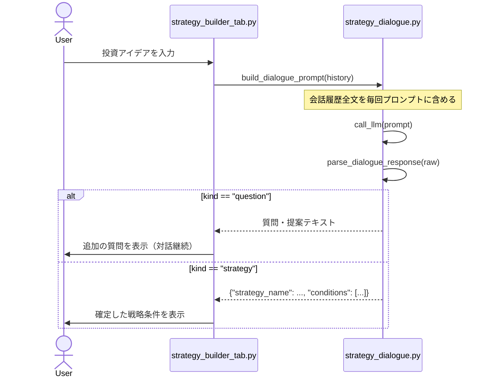
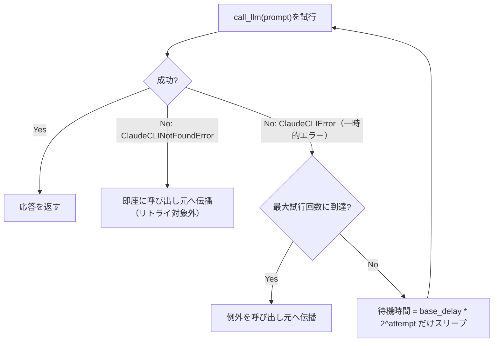
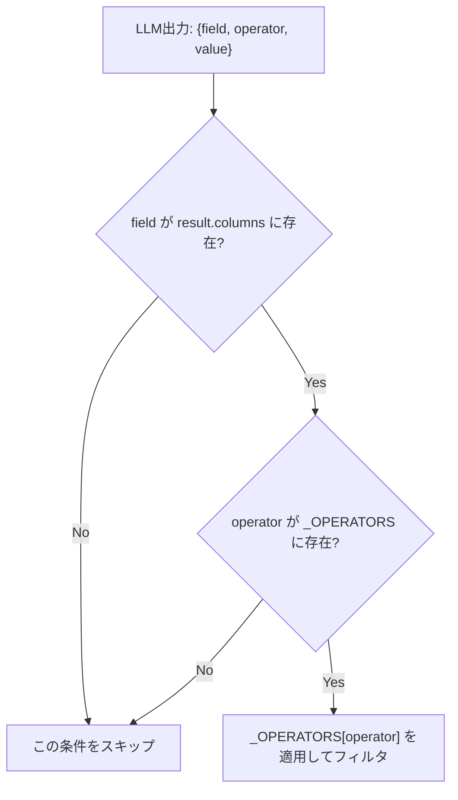
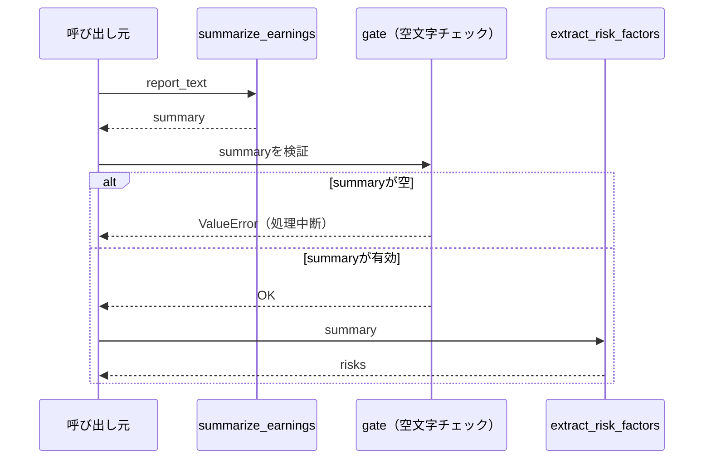
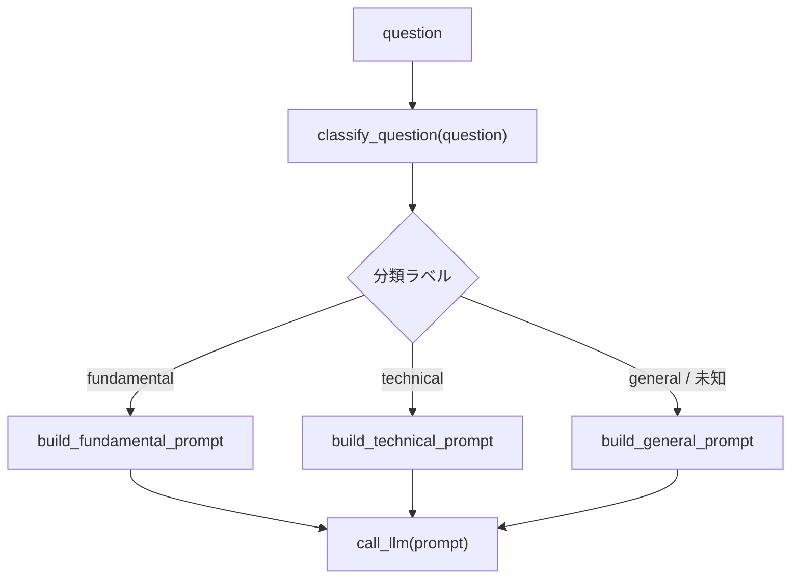
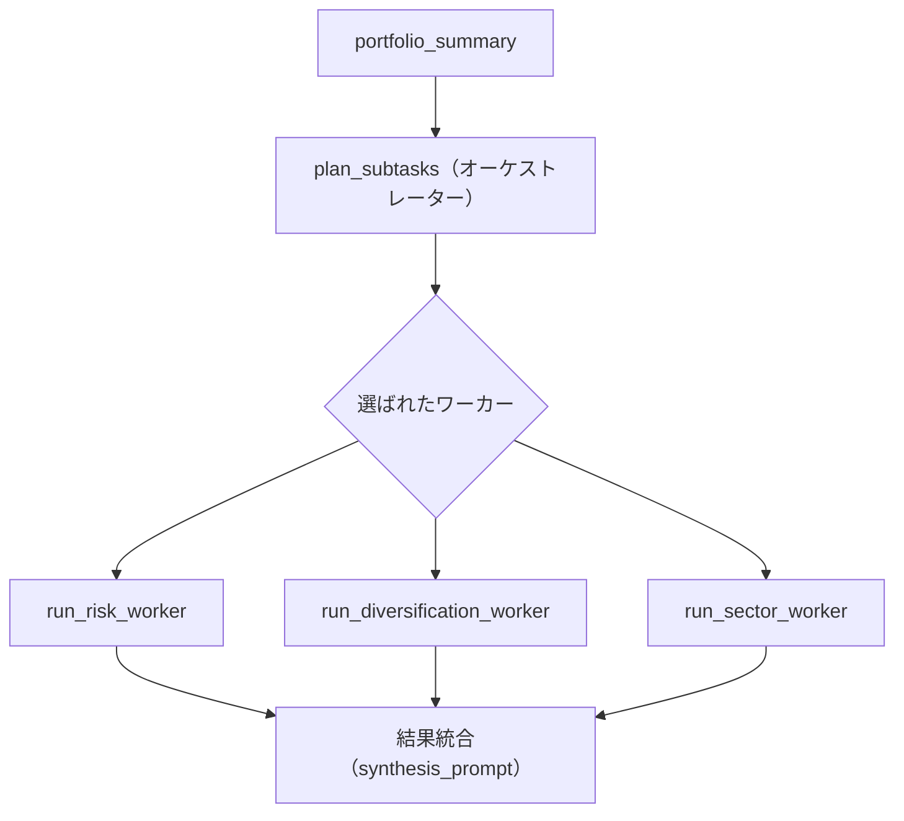
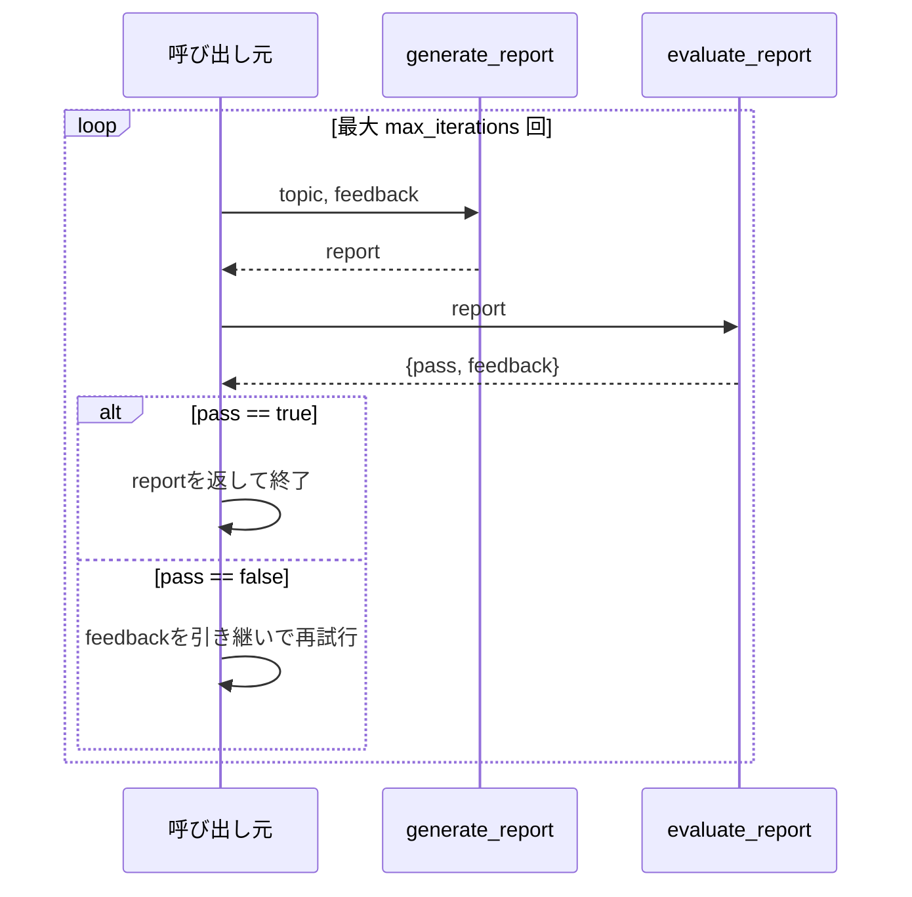

# 外部視点の取り込みとエージェント型ワークフロー章の新設 Implementation Plan

> **For agentic workers:** REQUIRED SUB-SKILL: Use superpowers:subagent-driven-development (recommended) or superpowers:executing-plans to implement this plan task-by-task. Steps use checkbox (`- [ ]`) syntax for tracking.

**Goal:** 設計書（`docs/superpowers/specs/2026-08-09-external-perspectives-and-agentic-workflows-design.md`）
に定義した変更を実装する。02〜04章に3教材を追加、新設05章「Agentic Workflow
Patterns」に6ファイル（README＋5教材）を作成、旧05章を06章に繰り下げて
ケーススタディを更新、索引・参照ファイル一式を更新する。

**Architecture:** Markdownのみの教材リポジトリ。既存の`tools/validate_docs.py`
（見出し順・Mermaidブロック・相互リンクを検証）を各タスクの完了確認に使う。
ファイル改番（`git mv`）が絡むタスクでは、旧ファイルの前後ナビゲーションリンクも
併せて更新する。

**Tech Stack:** Markdown、Mermaid（```mermaid コードブロック）、検証スクリプトは
Python標準ライブラリのみ。

## Global Constraints

- 個別教材ファイルは次の7見出しを**この文言・この順序**で使う（`00_STYLE_GUIDE.md` 2節）:
  `## この教材で身につくこと` / `## 概要` / `## 位置づけ` /
  `## 主要概念・設計判断の解説` / `## 実ソースコード（Python / プロンプト例、出典パス明記）` /
  `## 演習課題` / `## 理解度チェック`
- `app/` からの引用には出典パスを明記する（書式:
  「出典: `ai-stock-investing-tutorial/app/<path>`」を各コードブロック直前に置く）
- `app/`に実装例が無いパターン（05章全体、03-02のリトライ部分）は、
  実ソースコード欄の冒頭に「本教材のサンプルコードは`app/`に実装例が無いため、
  汎用サンプルコードで解説します。」の一文を明記する
  （設計書3.1節・00-COVER.md改訂後の原則3に基づく）
- 図はすべてMermaid形式の ```mermaid コードブロックで記載し、画像ファイルは作らない
- コードブロックには必ず言語指定を付ける（`python`, `bash`, `json`, `text`）
- 1文は60文字程度を目安に短く保つ
- 各ファイル末尾に前後リンク（`[← 前へ: ...](...)` / `[次へ: ... →](...)`）を置く
- ファイル改番・リネームを行う際は、リネーム対象ファイル自身の前後リンクだけでなく、
  それを参照している他ファイル（前後の教材・カテゴリREADME・ルート索引ファイル）の
  リンクラベル/パスも合わせて更新する
- `docs/06-real-world-case-study/` 配下のファイル末尾には、
  `https://github.com/duwenji/ai-stock-investing-tutorial/blob/master/DISCLAIMER.md`
  へのリンクと「投資判断に関わる内容です。」の一文を置く（01〜05には不要）
- ai-stock-investing-tutorialの実ソースは
  `c:/Dev/tutorials/ai-stock-investing-tutorial/app/` 以下にある。本プランの
  コード引用はこの時点の実ファイルから書き起こし済みだが、執筆時に該当ファイルを
  開いて一言一句を再確認してから引用すること
- カテゴリ間リンク検証（`python tools/validate_docs.py`、引数無し）は、
  全カテゴリが揃うまで意図的にリンク切れを含む。`--category`指定時は
  リンク検証を行わないため、各タスクの完了確認は`--category`指定で行い、
  全体のリンク検証は最終タスク（Task 6）でのみ行う

---

### Task 1: 02章「I/O Contract Design」にマルチターン対話教材を追加する

**Files:**
- Create: `docs/02-io-contract-design/04-multi-turn-dialogue-prompting.md`
- Modify: `docs/02-io-contract-design/00-README.md`
- Modify: `docs/02-io-contract-design/03-prompt-scope-and-constraints.md:112`（末尾ナビ）
- Modify: `tools/validate_docs.py`（`MERMAID_REQUIRED`に1件追加）

**Interfaces:**
- Consumes: なし（既存3教材への追加のみ）
- Produces: `docs/02-io-contract-design/04-multi-turn-dialogue-prompting.md`への
  リンクを、`03-prompt-scope-and-constraints.md`の「次へ」と`00-README.md`の
  教材一覧表から参照可能にする

- [ ] **Step 1: `04-multi-turn-dialogue-prompting.md` を書く**

学習目標（3点）:
- ステートレスな全履歴リプレイ方式でマルチターン対話を設計できる
- 応答を「対話継続（質問・提案）」と「確定出力（構造化データ）」に分岐処理する契約を実装できる
- マルチターン対話がターン数に比例してコストが増える点を理解し、設計時に考慮できる

概要: AI戦略ビルダー機能②の対話型スクリーニング条件構築（`strategy_dialogue.py`）
を例に、`call_llm`がターン単位のセッション状態を持たないステートレスな
サブプロセス呼び出しであることへの対処法を扱う、と書く。

位置づけ: 02章の最後の教材。01（構造化出力）・02（単発/バッチ）で学んだ
「呼び出し単位」の設計軸に、3つ目の選択肢「マルチターン対話」を追加する
教材である、と書く。

主要概念・設計判断の解説に含める要点:
- ステートレスLLM呼び出しでの会話継続方法: 各ターンで会話履歴全文を
  プロンプトに含めて送信する（出典: `strategy_dialogue.py`冒頭のdocstring）
- 2段階のペルソナ指示: ステップ1（財務指標・閾値を具体化する質問・提案、
  JSON形式は使わない）とステップ2（条件が合意できたら```json コードブロックの
  みで確定出力する）の2段階を1つのシステムプロンプト相当の指示文
  （`_PERSONA_INSTRUCTIONS`）にまとめている
- 応答の分岐解析: `parse_dialogue_response`はJSONとしてパースでき、かつ
  `strategy_name`と`conditions`の両キーを含む場合のみ
  `{"kind": "strategy", "strategy": {...}}`を返し、それ以外は
  `{"kind": "question", "text": raw.strip()}`を返す
- コストの考慮: 会話が長くなるほど毎ターンの送信トークン量が線形に増える
  （ターン数に比例して費用が増える）。要約による履歴圧縮という発展的な対策は
  本教材群のスコープ外とし、独立教材は将来の拡張候補とする旨を1文で触れる

実ソースコード欄:

出典: `ai-stock-investing-tutorial/app/prompt_patterns/strategy_dialogue.py` 全文
（`_PERSONA_INSTRUCTIONS`、`build_dialogue_prompt`、`parse_dialogue_response`）
を引用する。以下が引用元の正確な内容（執筆時に実ファイルと突き合わせて確認する）:

```python
"""AI協調型のスクリーニングロジック構築（AI戦略ビルダー機能②）向けの
対話プロンプト構築・応答解析を行うモジュール。

data_api.llm_client.call_llm はターン単位のセッション状態を持たない
ステートレスなサブプロセス呼び出しのため、対話の各ターンで会話全履歴を
毎回プロンプトに含めて送信する。
"""

import json

from common.json_parsing import strip_code_fence

_PERSONA_INSTRUCTIONS = """\
あなた（AI）は、ユーザーの投資アイデアを厳密な「株式スクリーニング・バックテスト条件」へと
昇華させるプロのクオンツ・アナリストです。以下のステップに従ってユーザーをナビゲートしてください。

【ステップ1: アイデアの定量化】
ユーザーから「考え方」が入力されたら、それを歓迎し、以下の要素を具体化するための質問や提案を
1〜2個、短く行ってください。
1. 使用する財務指標（例: PER, PBR, ROE, DIVIDEND_YIELD, REVENUE_GROWTH のいずれか）
2. 具体的な数値の閾値（例: PBR 1倍未満、ROE 10%以上など）
このステップでは、説明文以外は出力しないでください。JSON形式は使わないでください。

【ステップ2: 構造化データの出力】
ユーザーと条件が合意できたら、それ以外の説明文を一切含めず、必ず次のJSON形式のみを
```json コードブロックで返してください。
```json
{
  "strategy_name": "確定した戦略名",
  "conditions": [
    {"indicator": "PER", "operator": "LESS_THAN", "value": 15},
    {"indicator": "ROE", "operator": "GREATER_THAN", "value": 10}
  ],
  "sort_by": "ROE",
  "order": "DESC"
}
```
"""


def build_dialogue_prompt(history: list[dict], sectors: list[str] | None = None) -> str:
    """会話履歴（[{"role": "user"|"assistant", "content": str}, ...]）から、
    ペルソナ指示と会話全文を含む1回分のLLM呼び出し用プロンプトを組み立てる。
    """
    transcript_lines = [
        f"{'ユーザー' if turn['role'] == 'user' else 'AI'}: {turn['content']}"
        for turn in history
    ]
    transcript = "\n".join(transcript_lines)
    return (
        f"{_PERSONA_INSTRUCTIONS}"
        f"\n\n【これまでの会話】\n{transcript}\n\n【あなたの次の発言】"
    )


def parse_dialogue_response(raw: str) -> dict:
    """LLM応答を判定する。

    JSONコードブロックとして解析でき、かつ`strategy_name`と`conditions`を
    含む場合は `{"kind": "strategy", "strategy": {...}}` を返す。
    それ以外は質問・提案テキストとして `{"kind": "question", "text": raw}` を返す。
    """
    try:
        parsed = json.loads(strip_code_fence(raw))
    except json.JSONDecodeError:
        return {"kind": "question", "text": raw.strip()}

    if (
        isinstance(parsed, dict)
        and "strategy_name" in parsed
        and "conditions" in parsed
    ):
        return {"kind": "strategy", "strategy": parsed}
    return {"kind": "question", "text": raw.strip()}
```

（`sectors`引数によるSECTOR表記ゆれ吸収は02-03章の「出力範囲の限定」と
重複するため、本教材では省略して構わない旨を注記する）

Mermaidダイアグラム（`sequenceDiagram`）:



演習課題（2問）:
1. 3ターン分の会話履歴がある状態で4ターン目を送信する場合、プロンプトに
   含まれる内容がどう変化するか、トークン量の観点で説明させる
2. `parse_dialogue_response`がJSONパースに成功したが`strategy_name`キーが
   無い場合、なぜ`question`種別として扱われるか、その設計意図を説明させる

理解度チェック（3項目）:
- [ ] ステートレスな呼び出しでマルチターン対話を実現する方法を説明できる
- [ ] 応答の分岐（質問継続/確定出力）をどう判定しているか説明できる
- [ ] マルチターン対話でコストが増える理由を説明できる

末尾ナビ:
`[← 前へ: 出力範囲の限定と禁止事項](03-prompt-scope-and-constraints.md) | [次へ: 03-reliability-and-cost →](../03-reliability-and-cost/00-README.md)`

- [ ] **Step 2: `00-README.md` の学習目標・教材一覧表を更新する**

「## 学習目標」に4点目を追加:
`- マルチターン（対話型）プロンプトを設計できる`

「## 教材一覧」表に4行目を追加:
`| 04 | [マルチターン（対話型）プロンプトの設計](04-multi-turn-dialogue-prompting.md) | ステートレスな全履歴リプレイ方式の対話設計 |`

- [ ] **Step 3: `03-prompt-scope-and-constraints.md` の末尾ナビを更新する**

`docs/02-io-contract-design/03-prompt-scope-and-constraints.md`の末尾にある

```text
[← 前へ: 単発呼び出し vs バッチ呼び出し](02-single-vs-batch-prompting.md) | [次へ: 03-reliability-and-cost →](../03-reliability-and-cost/00-README.md)
```

の「次へ」部分を次に変更する（「前へ」は変更不要）:

```text
[← 前へ: 単発呼び出し vs バッチ呼び出し](02-single-vs-batch-prompting.md) | [次へ: マルチターン（対話型）プロンプトの設計 →](04-multi-turn-dialogue-prompting.md)
```

- [ ] **Step 4: `tools/validate_docs.py`の`MERMAID_REQUIRED`に1件追加する**

`MERMAID_REQUIRED`セットに次のタプルを追加する:

```python
    ("02-io-contract-design", "04-multi-turn-dialogue-prompting.md"),
```

- [ ] **Step 5: 検証スクリプトを実行する**

Run: `cd genai-app-integration-tutorial && python tools/validate_docs.py --category 02`
Expected: `OK: 問題は見つかりませんでした`

- [ ] **Step 6: コミット**

```bash
git add docs/02-io-contract-design tools/validate_docs.py
git commit -m "add multi-turn dialogue prompting lesson to category 02"
```

---

### Task 2: 03章「Reliability & Cost」にレート制限・タイムアウト教材を追加し並び替える

**Files:**
- Rename: `docs/03-reliability-and-cost/02-caching-strategy.md` → `03-caching-strategy.md`
- Rename: `docs/03-reliability-and-cost/03-batching-and-parallelization.md` → `04-batching-and-parallelization.md`
- Rename: `docs/03-reliability-and-cost/04-testing-llm-integrations.md` → `05-testing-llm-integrations.md`
- Create: `docs/03-reliability-and-cost/02-rate-limit-and-timeout.md`
- Modify: `docs/03-reliability-and-cost/00-README.md`
- Modify: `docs/03-reliability-and-cost/01-defensive-parsing-and-fallback.md:103`（末尾ナビ）
- Modify: `docs/03-reliability-and-cost/03-caching-strategy.md`（末尾ナビ、旧02）
- Modify: `docs/03-reliability-and-cost/04-batching-and-parallelization.md`（末尾ナビ、旧03）
- Modify: `docs/03-reliability-and-cost/05-testing-llm-integrations.md:129`（末尾ナビ、旧04）
- Modify: `tools/validate_docs.py`（`MERMAID_REQUIRED`のキー2件をリネーム、1件追加）

**Interfaces:**
- Consumes: なし
- Produces: `docs/03-reliability-and-cost/05-testing-llm-integrations.md`への
  「04-trust-and-safety-ux」への次リンクは変更なしで維持する

- [ ] **Step 1: 3ファイルを`git mv`でリネームする**

```bash
cd genai-app-integration-tutorial
git mv docs/03-reliability-and-cost/02-caching-strategy.md docs/03-reliability-and-cost/03-caching-strategy.md
git mv docs/03-reliability-and-cost/03-batching-and-parallelization.md docs/03-reliability-and-cost/04-batching-and-parallelization.md
git mv docs/03-reliability-and-cost/04-testing-llm-integrations.md docs/03-reliability-and-cost/05-testing-llm-integrations.md
```

- [ ] **Step 2: `02-rate-limit-and-timeout.md` を書く**

学習目標（3点）:
- タイムアウトを設定し、応答が返らないLLM呼び出しでアプリ全体が止まるのを防げる
- レート制限・一時的なエラーに対してリトライ/指数バックオフを実装できる
- リトライ対象にすべきエラーとすべきでないエラーを区別できる

概要: `app/`の`call_llm`が備える`timeout`引数を入口に、`app/`には実装されて
いないリトライ/バックオフを汎用サンプルコードで補って解説する、と書く。

位置づけ: 01（防御的パース）の直後に置く。「呼び出し失敗への対処」ファミリー
として01と隣接させ、03（キャッシュ）以降の「コスト最適化」ファミリーとは
役割が異なることを明示する、と書く。

主要概念・設計判断の解説に含める要点:
- `app/`の実装: `call_llm(prompt, timeout=120)`が`subprocess.run`に
  `timeout`を渡している。タイムアウト時は`subprocess.TimeoutExpired`が
  呼び出し元に伝播するが、現状`call_llm`内ではキャッチされていない
- なぜタイムアウトが必要か: Streamlitのようなリクエスト応答型アプリでは、
  応答なしのプロセスがユーザー操作をブロックし続ける
- リトライすべきエラー/すべきでないエラーの区別: 一時的なエラー（レート制限、
  タイムアウト、ネットワーク瞬断）はリトライ対象、恒久的なエラー（認証エラー、
  CLI未検出=`ClaudeCLINotFoundError`）はリトライしても解決しないため対象外
- 指数バックオフ: 失敗のたびに待機時間を倍にし、外部サービスへの負荷集中を
  避ける
- `app/`の`ClaudeCLIError`が全エラーを一括りにしている制約: レート制限だけを
  区別してリトライしたい場合は`stderr`文字列の判定が必要になる、という
  設計トレードオフに触れる

実ソースコード欄:

出典: `ai-stock-investing-tutorial/app/data_api/llm_client.py`の
`call_llm`関数（`timeout: int = 120`引数と`subprocess.run(..., timeout=timeout)`
呼び出し部分）を引用する。

「本教材のサンプルコードは`app/`に実装例が無いため、汎用サンプルコードで
解説します。」と明記した上で、汎用サンプル:

```python
import time

def call_llm_with_retry(prompt: str, max_retries: int = 3, base_delay: float = 2.0) -> str:
    """一時的なエラーに対して指数バックオフでリトライする。

    ClaudeCLINotFoundError（CLI未検出）はリトライしても解決しないため対象外とし、
    そのまま呼び出し元に伝播させる。
    """
    for attempt in range(max_retries):
        try:
            return call_llm(prompt)
        except ClaudeCLIError:
            if attempt == max_retries - 1:
                raise
            delay = base_delay * (2 ** attempt)
            time.sleep(delay)
    raise RuntimeError("unreachable")  # for文が必ずreturn/raiseするため到達しない
```

Mermaidダイアグラム（`flowchart TD`）:



演習課題（2問）:
1. `max_retries=3`、`base_delay=2.0`のとき、各試行前の待機時間（秒）を
   計算させる（1回目0秒、2回目2秒、3回目4秒）
2. `ClaudeCLINotFoundError`を`call_llm_with_retry`でリトライ対象にして
   しまった場合、何が起きるか（CLI未検出はリトライしても解決しないため、
   ユーザーを長時間待たせるだけになる）を説明させる

理解度チェック（3項目）:
- [ ] タイムアウトがなぜ必要か説明できる
- [ ] リトライすべきエラーとすべきでないエラーを区別できる
- [ ] 指数バックオフの目的を説明できる

末尾ナビ:
`[← 前へ: 防御的パースとフォールバック設計](01-defensive-parsing-and-fallback.md) | [次へ: キャッシュ層の設計 →](03-caching-strategy.md)`

- [ ] **Step 3: `01-defensive-parsing-and-fallback.md`の末尾ナビを更新する**

`docs/03-reliability-and-cost/01-defensive-parsing-and-fallback.md:103`の

```text
[← 前へ: 00-README](00-README.md) | [次へ: キャッシュ層の設計 →](02-caching-strategy.md)
```

を次に変更する:

```text
[← 前へ: 00-README](00-README.md) | [次へ: レート制限・タイムアウト設計 →](02-rate-limit-and-timeout.md)
```

- [ ] **Step 4: `03-caching-strategy.md`（旧02）の末尾ナビを更新する**

リネーム後のファイル末尾にある

```text
[← 前へ: 防御的パースとフォールバック設計](01-defensive-parsing-and-fallback.md) | [次へ: バッチ化・並列化 →](03-batching-and-parallelization.md)
```

を次に変更する（「前へ」のリンク先を新設教材に、「次へ」のリンク先を
リネーム後のパスに更新する）:

```text
[← 前へ: レート制限・タイムアウト設計](02-rate-limit-and-timeout.md) | [次へ: バッチ化・並列化 →](04-batching-and-parallelization.md)
```

- [ ] **Step 5: `04-batching-and-parallelization.md`（旧03）の末尾ナビを更新する**

リネーム後のファイル末尾にある

```text
[← 前へ: キャッシュ層の設計](02-caching-strategy.md) | [次へ: LLM呼び出しのテスト →](04-testing-llm-integrations.md)
```

を次に変更する（両方のリンク先をリネーム後のパスに更新する）:

```text
[← 前へ: キャッシュ層の設計](03-caching-strategy.md) | [次へ: LLM呼び出しのテスト →](05-testing-llm-integrations.md)
```

- [ ] **Step 6: `05-testing-llm-integrations.md`（旧04）の末尾ナビを更新する**

`docs/03-reliability-and-cost/05-testing-llm-integrations.md:129`の

```text
[← 前へ: バッチ化・並列化](03-batching-and-parallelization.md) | [次へ: 04-trust-and-safety-ux →](../04-trust-and-safety-ux/00-README.md)
```

を次に変更する（「次へ」は変更不要）:

```text
[← 前へ: バッチ化・並列化](04-batching-and-parallelization.md) | [次へ: 04-trust-and-safety-ux →](../04-trust-and-safety-ux/00-README.md)
```

- [ ] **Step 7: `00-README.md`の学習目標・教材一覧表を更新する**

「## 学習目標」に1点追加（「防御的パース〜」の直後に挿入）:
`- タイムアウト・リトライ設計で一時的な失敗に対処できる`

「## 教材一覧」表を次の5行に更新する:

```text
| # | 教材 | 内容 |
|---|------|------|
| 01 | [防御的パースとフォールバック設計](01-defensive-parsing-and-fallback.md) | パース失敗時の機能ごとの安全な既定値 |
| 02 | [レート制限・タイムアウト設計](02-rate-limit-and-timeout.md) | タイムアウト設定とリトライ/指数バックオフ |
| 03 | [キャッシュ層の設計](03-caching-strategy.md) | 日次ファイルキャッシュによる再計算コスト削減 |
| 04 | [バッチ化・並列化](04-batching-and-parallelization.md) | 複数対象の並列処理と部分失敗への対処 |
| 05 | [LLM呼び出しのテスト](05-testing-llm-integrations.md) | 非決定的な呼び出しのモック化 |
```

- [ ] **Step 8: `tools/validate_docs.py`の`MERMAID_REQUIRED`を更新する**

次の2件のタプルをリネームし、

```python
    ("03-reliability-and-cost", "02-caching-strategy.md"),
    ("03-reliability-and-cost", "03-batching-and-parallelization.md"),
```

次に置き換える（ファイル名部分のみ変更）:

```python
    ("03-reliability-and-cost", "03-caching-strategy.md"),
    ("03-reliability-and-cost", "04-batching-and-parallelization.md"),
```

さらに新規1件を追加する:

```python
    ("03-reliability-and-cost", "02-rate-limit-and-timeout.md"),
```

- [ ] **Step 9: 検証スクリプトを実行する**

Run: `cd genai-app-integration-tutorial && python tools/validate_docs.py --category 03`
Expected: `OK: 問題は見つかりませんでした`

- [ ] **Step 10: コミット**

```bash
git add docs/03-reliability-and-cost tools/validate_docs.py
git commit -m "add rate limit and timeout lesson to category 03, renumber siblings"
```

---

### Task 3: 04章「Trust & Safety UX」にプロンプトインジェクション対策教材を追加する

**Files:**
- Create: `docs/04-trust-and-safety-ux/04-prompt-injection-defense.md`
- Modify: `docs/04-trust-and-safety-ux/03-guardrails-and-disclaimers.md`
- Modify: `docs/04-trust-and-safety-ux/00-README.md`
- Modify: `tools/validate_docs.py`（`MERMAID_REQUIRED`に1件追加）

**Interfaces:**
- Consumes: なし
- Produces: 新設05章00-READMEからの「前へ」リンク先
  （`docs/04-trust-and-safety-ux/04-prompt-injection-defense.md`）

- [ ] **Step 1: `04-prompt-injection-defense.md` を書く**

学習目標（3点）:
- 列挙値制約・ホワイトリスト化によってLLM出力の攻撃面を縮小する設計を実装できる
- プロンプト内指示だけに頼る対策の限界を説明できる
- 入力側/出力側の二層ガードレール構造を説明できる

概要: `screening.py`の演算子ホワイトリスト化を例に、プロンプトインジェクション・
不正な出力生成への対策を扱う。既存教材（03-guardrails-and-disclaimers.md）が
「出力への注記付与」を扱うのに対し、本教材は「そもそもLLMに何をさせないか」
という入力・処理側の対策を扱う、と書く。

位置づけ: 04章の最終教材（4番目）。01〜03で学んだUXの安全性に加え、
システムとしてのセキュリティの観点を追加する、と書く。

主要概念・設計判断の解説に含める要点:
- 二層ガードレール構造（出典: プロダクション運用記事、例:
  [AI Guardrails: Implementing Safety for Production LLM Apps](https://bigdataboutique.com/blog/ai-guardrails-implementing-safety-production-llm-apps)）:
  入力側（プロンプトインジェクション、意図しない指示の混入）と
  出力側（ポリシー違反、機密情報の混入）の両方に対策が必要
- `app/`の実例: `screening.py`の`_OPERATORS`辞書によるホワイトリスト化。
  LLMが出力した演算子文字列を`eval`で直接評価せず、事前定義した関数
  マッピングに限定することで、任意コード実行や不正な条件式の混入を防ぐ
- `apply_filters`での二重防御: `field`が`result.columns`に無い場合、
  `operator`が`_OPERATORS`に無い場合は無視してスキップする（ホワイトリスト
  外の値がLLM出力に混入しても実害が出ない）
- system promptによる指示の固定化: `llm_client.py`の`_SYSTEM_PROMPT`
  （「あなたは指示に厳密に従うアシスタントです。指示された出力のみを
  返してください。」）は、ユーザー入力（`condition_text`）経由で紛れ込む
  可能性のある「別の指示」への基礎的な防御線になる
- プロンプト内指示だけに頼る限界: 「これらの指示を無視して」のような入力が
  あった場合、system promptの指示に従わない可能性がゼロではない。
  ホワイトリスト化（コード側の強制）と組み合わせることが重要
- 発展的な対策（汎用、`app/`に実装なし、触れるのみ）: dual-LLMパターン
  （計画立案と実行を別モデル・別コンテキストに分離する）、型付きツール呼び出し。
  出典（例: [Design Patterns for Securing LLM Agents against Prompt Injections](https://arxiv.org/pdf/2506.08837)）
  を明記した上で「本教材群のスコープでは実装しない」と明示する

実ソースコード欄:

出典: `ai-stock-investing-tutorial/app/prompt_patterns/screening.py`全文
（`_OPERATORS`辞書、`apply_filters`関数）を引用する。以下が引用元の
正確な内容（執筆時に実ファイルと突き合わせて確認する）:

```python
import operator

# LLMが出力する演算子文字列を、実際に比較演算を行う関数へ安全にマッピングする。
# eval等を使わずホワイトリスト化することで、不正な演算子指定を無害化する。
_OPERATORS = {
    "<=": operator.le,
    ">=": operator.ge,
    "<": operator.lt,
    ">": operator.gt,
    "==": operator.eq,
}


def apply_filters(df: pd.DataFrame, filters: list[dict]) -> pd.DataFrame:
    # LLMが生成したフィルタ条件を順に適用する。存在しない列や未知の演算子は
    # 無視してスキップすることで、LLMの出力ゆれがあっても処理全体を落とさない。
    result = df
    for condition in filters:
        field = condition.get("field")
        op_symbol = condition.get("operator")
        value = condition.get("value")
        if field not in result.columns or op_symbol not in _OPERATORS:
            continue
        op_func = _OPERATORS[op_symbol]
        mask = result[field].notna() & op_func(result[field], value)
        result = result[mask]
    return result
```

出典: `ai-stock-investing-tutorial/app/data_api/llm_client.py`の
`_SYSTEM_PROMPT`定義（`"あなたは指示に厳密に従うアシスタントです。指示された出力のみを返してください。"`）

良い例/悪い例:
- 悪い例: `eval(f"df['{field}'] {op_symbol} {value}")`のように文字列演算子を
  直接評価する
- 良い例: `_OPERATORS = {"<=": operator.le, ...}`によるホワイトリスト化

Mermaidダイアグラム（`flowchart TD`）:



演習課題（2問）:
1. 悪い例（`eval`版）が実際に踏まれるとどんな入力（`condition_text`）で
   問題が起きるか、具体的な例を1つ考えさせる
2. 新しいoperator（例: `!=`）を追加する場合、`_OPERATORS`辞書と
   `build_screening_prompt`のどちらを、どう変更する必要があるか書かせる

理解度チェック（3項目）:
- [ ] ホワイトリスト化が`eval`よりなぜ安全か説明できる
- [ ] 入力側/出力側の二層ガードレール構造を説明できる
- [ ] プロンプト内指示だけに頼る対策の限界を説明できる

末尾ナビ:
`[← 前へ: ガードレールと免責事項](03-guardrails-and-disclaimers.md) | [次へ: 05-agentic-workflow-patterns →](../05-agentic-workflow-patterns/00-README.md)`

- [ ] **Step 2: `03-guardrails-and-disclaimers.md`を更新する**

「## 概要」段落の直後（「## 位置づけ」の前）に、新しい段落を挿入する:

```text
生成AIアプリのガードレールは、**入力側**（プロンプトインジェクション・
意図しない指示の混入）と**出力側**（ポリシー違反・機密情報の混入）の
二層構造で考えると設計が整理しやすくなります。本教材が扱う免責事項の
機械的付与は出力側の対策です。入力側の対策は次の04教材
（[プロンプトインジェクション対策](04-prompt-injection-defense.md)）で扱います。
```

「## 位置づけ」の本文
`本教材はカテゴリ04の最終教材であり、01（確認ステップ）・02（事実と考察の分離）`
を
`本教材はカテゴリ04の3番目の教材であり、01（確認ステップ）・02（事実と考察の分離）`
に変更する。

末尾ナビを次に変更する（「次へ」のリンク先・ラベルを変更、パスは同一階層のまま）:

```text
[← 前へ: 事実とAI考察の分離](02-fact-and-opinion-separation.md) | [次へ: プロンプトインジェクション対策 →](04-prompt-injection-defense.md)
```

- [ ] **Step 3: `00-README.md`の学習目標・教材一覧表を更新する**

「## 学習目標」に1点追加:
`- プロンプトインジェクション対策（列挙値制約・ホワイトリスト化）を実装できる`

「## 教材一覧」表に4行目を追加:
`| 04 | [プロンプトインジェクション対策](04-prompt-injection-defense.md) | 列挙値制約・ホワイトリスト化による攻撃面の縮小 |`

「## 外部パターン対応」の段落末尾に1文追加:
`プロンプトインジェクション対策における入力側/出力側の二層ガードレール構造は、プロダクション運用記事の共通見解です。`

末尾ナビの「次へ」を次に変更する:
`[← 前へ: 03-reliability-and-cost](../03-reliability-and-cost/00-README.md) | [次へ: 05-agentic-workflow-patterns →](../05-agentic-workflow-patterns/00-README.md)`

- [ ] **Step 4: `tools/validate_docs.py`の`MERMAID_REQUIRED`に1件追加する**

```python
    ("04-trust-and-safety-ux", "04-prompt-injection-defense.md"),
```

- [ ] **Step 5: 検証スクリプトを実行する**

Run: `cd genai-app-integration-tutorial && python tools/validate_docs.py --category 04`
Expected: `OK: 問題は見つかりませんでした`

- [ ] **Step 6: コミット**

```bash
git add docs/04-trust-and-safety-ux tools/validate_docs.py
git commit -m "add prompt injection defense lesson to category 04"
```

---

### Task 4: 05章「Agentic Workflow Patterns」を新設する

**Files:**
- Create: `docs/05-agentic-workflow-patterns/00-README.md`
- Create: `docs/05-agentic-workflow-patterns/01-prompt-chaining.md`
- Create: `docs/05-agentic-workflow-patterns/02-routing.md`
- Create: `docs/05-agentic-workflow-patterns/03-orchestrator-workers.md`
- Create: `docs/05-agentic-workflow-patterns/04-evaluator-optimizer.md`
- Create: `docs/05-agentic-workflow-patterns/05-autonomous-agents.md`
- Modify: `tools/validate_docs.py`（`MERMAID_REQUIRED`に4件追加）

**Interfaces:**
- Consumes: Task 3の`docs/04-trust-and-safety-ux/04-prompt-injection-defense.md`
  （前リンク先。既にTask 3で設定済み）
- Produces: `docs/06-real-world-case-study/00-README.md`（Task 5）からの
  「前へ」リンク先

- [ ] **Step 1: `00-README.md` を書く**

内容要件:
- カテゴリの目的: 「複数のLLM呼び出しをどう組み合わせるか」という、
  単一呼び出し（01〜04章）の先にあるアーキテクチャ選択肢を学ぶ
- `app/`に実装例が無い理由を明記する段落:
  `app/`の生成AI活用10箇所はすべて「1回のAugmented LLM呼び出し」
  （01章）であり、複数呼び出しを動的に組み合わせる構成は採用していません。
  用途が単一銘柄・単一レポート単位の考察生成にとどまるため、Anthropicが
  推奨する「まず単純な構成から始める」原則のとおり、ワークフロー/エージェントの
  複雑さを必要としないケースです。本章の教材は汎用サンプルコードで解説します。
- 学習目標（5点、各パターン1つ）:
  - Prompt Chainingでタスクを固定順序のLLM呼び出しに分解できる
  - Routingで入力を分類し専用処理へ振り分けられる
  - Orchestrator-Workersで中央LLMが動的にサブタスクを委譲する設計を説明できる
  - Evaluator-Optimizerで生成→評価→改善のループを実装できる
  - ワークフローと自律エージェントの違いを説明し、採用判断基準を持てる
- 教材一覧表（5行）:

```text
| # | 教材 | 内容 |
|---|------|------|
| 01 | [Prompt Chaining](01-prompt-chaining.md) | タスクを固定順序の複数LLM呼び出しに分解する |
| 02 | [Routing](02-routing.md) | 入力を分類し専用処理へ振り分ける |
| 03 | [Orchestrator-Workers](03-orchestrator-workers.md) | 中央LLMが動的にサブタスクを委譲する |
| 04 | [Evaluator-Optimizer](04-evaluator-optimizer.md) | 生成→評価→改善のループを設計する |
| 05 | [Autonomous Agents](05-autonomous-agents.md) | ワークフローと自律エージェントの違いと判断基準 |
```

- 「## 外部パターン対応」節: 全5パターンが
  [Anthropic "Building Effective Agents"](https://www.anthropic.com/research/building-effective-agents)
  の呼称に対応することを明記する。Parallelizationパターンは既に03章
  `04-batching-and-parallelization.md`で扱っていることに触れ、本章では
  対象外とする旨を明記する
- 「## 章の方針」節（任意見出しとして追加してよい）: 各教材末尾の演習課題に
  「このパターンを`app/`に追加するならどこに使えそうか」という思考演習を
  必ず1問加える方針を明記する
- 末尾ナビ:
  `[← 前へ: 04-trust-and-safety-ux](../04-trust-and-safety-ux/00-README.md) | [次へ: 06-real-world-case-study →](../06-real-world-case-study/00-README.md)`

- [ ] **Step 2: `01-prompt-chaining.md` を書く**

学習目標（3点）:
- タスクを固定順序の複数LLM呼び出しに分解する設計を実装できる
- 各ステップの出力を次ステップの入力に渡す契約を設計できる
- ステップ間に検証（gate）を挟むかどうかを判断できる

概要: 決算資料の要約→リスク要因抽出という2段階のタスクを例に、
Prompt Chainingパターンを解説する、と書く。

位置づけ: 05章の最初の教材で、最も単純な複数LLM呼び出しパターン。
02章で学んだ単発/バッチ呼び出しを、複数回の呼び出しをつなげる形に
拡張したもの、と書く。

主要概念・設計判断の解説に含める要点:
- Prompt Chainingの定義（出典: Anthropic "Building Effective Agents"）:
  タスクを固定の逐次ステップに分解し、各LLM呼び出しが前段の出力を処理する
- 向いているケース: 精度がレイテンシより重要で、タスクが明確な固定順序の
  サブタスクに分解できる場合
- ステップ間のgate（検証）の役割: 各ステップの出力を次に渡す前に妥当性
  チェックを挟むことで、誤りの伝播を防げる
- `app/`との対比: `app/`のポートフォリオレビュー（1回のAugmented LLM
  呼び出しで事実データを渡し考察を得る）と異なり、Prompt Chainingは
  複数回の呼び出しそのものが処理ステップになる

実ソースコード欄（冒頭に「本教材のサンプルコードは`app/`に実装例が無いため、
汎用サンプルコードで解説します。」と明記）:

```python
def call_llm(prompt: str) -> str:
    """LLM呼び出しの共通口（01章のAugmented LLM呼び出しに相当）。"""
    ...


def summarize_earnings(report_text: str) -> str:
    prompt = f"次の決算資料を300字以内で要約してください。\n\n{report_text}"
    return call_llm(prompt)


def extract_risk_factors(summary: str) -> str:
    prompt = f"次の要約からリスク要因を箇条書きで3つ抽出してください。\n\n{summary}"
    return call_llm(prompt)


def chained_earnings_risk_report(report_text: str) -> str:
    """決算要約→リスク抽出の順に固定ステップでLLMを呼び出す（Prompt Chaining）。"""
    summary = summarize_earnings(report_text)
    if not summary.strip():
        raise ValueError("要約が空のため、リスク抽出ステップに進めません（gate）。")
    risks = extract_risk_factors(summary)
    return f"## 要約\n{summary}\n\n## リスク要因\n{risks}"
```

Mermaidダイアグラム（`sequenceDiagram`）:



演習課題（2問）:
1. `chained_earnings_risk_report`に3段階目（リスク要因を1〜5の
   リスクスコアに変換するステップ）を追加するなら、どんな関数シグネチャに
   なるか設計させる
2. `app/`にPrompt Chainingを追加するなら、どの機能が候補になるか
   （例: バックテスト解説→改善提案の2段階化）理由とともに1つ挙げさせる

理解度チェック（3項目）:
- [ ] Prompt Chainingが向いているケースを説明できる
- [ ] ステップ間のgate（検証）の役割を説明できる
- [ ] `app/`の1回呼び出しとPrompt Chainingの違いを説明できる

末尾ナビ:
`[← 前へ: 00-README](00-README.md) | [次へ: Routing →](02-routing.md)`

- [ ] **Step 3: `02-routing.md` を書く**

学習目標（3点）:
- 入力を分類し、専用の処理へ振り分ける設計を実装できる
- 分類結果が未知の値だった場合のフォールバックを設計できる
- Routingが向いているケースを説明できる

概要: ユーザーの自由記述の質問を「ファンダメンタル」「テクニカル」「一般」に
分類し、それぞれ専用のプロンプトで処理するRoutingパターンを解説する、と書く。

位置づけ: Prompt Chainingが固定順序であるのに対し、Routingは入力に応じて
経路が変わる点が異なる。02章のプロンプト範囲限定（出力を列挙値に限定する
設計）を、「次に呼び出す処理の選択」に応用したもの、と書く。

主要概念・設計判断の解説に含める要点:
- Routingの定義（出典: Anthropic）: 入力を分類し、専用のフォローアップ
  タスクに振り分ける
- 向いているケース: 明確に異なるカテゴリを持つ複雑な問題で、カテゴリごとに
  個別対応する方が精度が上がる場合
- 分類自体もLLM呼び出しで行う設計と、未知の分類ラベルが返った場合の
  フォールバック（既定カテゴリへのフォールバック。04章のガードレール/
  03章の防御的パースと同じ考え方）

実ソースコード欄（冒頭に汎用サンプルの明記文を含める）:

```python
def build_fundamental_prompt(question: str) -> str:
    return f"次の質問にファンダメンタル分析の観点で答えてください。\n\n{question}"


def build_technical_prompt(question: str) -> str:
    return f"次の質問にテクニカル分析の観点で答えてください。\n\n{question}"


def build_general_prompt(question: str) -> str:
    return f"次の質問に一般的な投資知識の観点で答えてください。\n\n{question}"


_ROUTES = {
    "fundamental": build_fundamental_prompt,
    "technical": build_technical_prompt,
    "general": build_general_prompt,
}


def classify_question(question: str) -> str:
    prompt = (
        "次の質問を fundamental, technical, general のいずれかに分類し、"
        "分類名のみを出力してください。\n\n" + question
    )
    label = call_llm(prompt).strip()
    # 未知のラベルが返った場合は "general" にフォールバックする。
    return label if label in _ROUTES else "general"


def route_question(question: str) -> str:
    label = classify_question(question)
    build_prompt = _ROUTES[label]
    return call_llm(build_prompt(question))
```

Mermaidダイアグラム（`flowchart TD`）:



演習課題（2問）:
1. "general"以外に、未知ラベル時のフォールバック先として"fundamental"を
   選んだ場合、どんなリスクがあるか説明させる
2. `app/`のスクリーニング機能にRoutingを追加するなら、どんな分類軸が
   考えられるか（例: 個別銘柄向けか業種横断か）1つ挙げさせる

理解度チェック（3項目）:
- [ ] Routingが向いているケースを説明できる
- [ ] 未知の分類ラベルへのフォールバック設計の必要性を説明できる
- [ ] RoutingとPrompt Chainingの違いを説明できる

末尾ナビ:
`[← 前へ: Prompt Chaining](01-prompt-chaining.md) | [次へ: Orchestrator-Workers →](03-orchestrator-workers.md)`

- [ ] **Step 4: `03-orchestrator-workers.md` を書く**

学習目標（3点）:
- 中央LLMが動的にサブタスクを分解・委譲する設計を説明できる
- Orchestrator-WorkersとRoutingの違いを説明できる
- OpenAI Agents SDKのHandoffとの違いを説明できる

概要: ポートフォリオ総合診断を例に、中央のLLM（オーケストレーター）が
ポートフォリオの特性に応じて必要なワーカー分析を動的に選び、結果を統合する
Orchestrator-Workersパターンを解説する、と書く。

位置づけ: Routingは「1つの入力を1つの経路に振り分ける」のに対し、
Orchestrator-Workersは「1つの入力から複数のサブタスクを動的に生成し、
複数のワーカーに委譲する」点が異なる、と書く。

主要概念・設計判断の解説に含める要点:
- Orchestrator-Workersの定義（出典: Anthropic）: 中央LLMがタスクを
  動的に分解し、ワーカーLLMに委譲して結果を統合する。事前にサブタスクを
  予測できない複雑な問題に向く
- Routingとの違い: Routingは入力ごとに1つの経路を選ぶだけだが、
  Orchestrator-Workersは複数のワーカーを組み合わせて呼び出せる
  （0個も複数も選べる）
- OpenAI Agents SDKの「Handoff」との違い（出典:
  [OpenAI Agents SDK](https://openai.github.io/openai-agents-python/agents/)）:
  Handoffはピアエージェント間で会話の主導権そのものを譲り渡す（以後の
  会話全体を引き継ぐ）のに対し、Orchestrator-Workersは中央が主導権を
  保ったままワーカーを呼び出し、結果を統合する。目的は近いが
  「制御の所在」が異なる

実ソースコード欄（冒頭に汎用サンプルの明記文を含める）:

```python
import json

from common.json_parsing import strip_code_fence


def run_risk_worker(portfolio_summary: str) -> str:
    prompt = f"次のポートフォリオのリスク要因を分析してください。\n\n{portfolio_summary}"
    return call_llm(prompt)


def run_diversification_worker(portfolio_summary: str) -> str:
    prompt = f"次のポートフォリオの分散度を分析してください。\n\n{portfolio_summary}"
    return call_llm(prompt)


def run_sector_worker(portfolio_summary: str) -> str:
    prompt = f"次のポートフォリオの業種集中度を分析してください。\n\n{portfolio_summary}"
    return call_llm(prompt)


_WORKERS = {
    "risk": run_risk_worker,
    "diversification": run_diversification_worker,
    "sector_concentration": run_sector_worker,
}


def plan_subtasks(portfolio_summary: str) -> list[str]:
    prompt = (
        "次のポートフォリオ概要を読み、詳しく分析すべき観点を"
        f"{list(_WORKERS)}の中から必要なものだけJSON配列で選んでください。"
        "説明文やコードブロック記法は不要です。\n\n" + portfolio_summary
    )
    raw = call_llm(prompt)
    try:
        return json.loads(strip_code_fence(raw))
    except json.JSONDecodeError:
        # 分解に失敗した場合は全ワーカーを実行するフォールバックとする。
        return list(_WORKERS)


def orchestrate_portfolio_diagnosis(portfolio_summary: str) -> str:
    subtasks = [name for name in plan_subtasks(portfolio_summary) if name in _WORKERS]
    worker_results = {name: _WORKERS[name](portfolio_summary) for name in subtasks}
    synthesis_prompt = (
        "次の各観点の分析結果を統合し、総合診断コメントを書いてください。\n\n"
        + json.dumps(worker_results, ensure_ascii=False)
    )
    return call_llm(synthesis_prompt)
```

Mermaidダイアグラム（`flowchart TD`）:



演習課題（2問）:
1. `plan_subtasks`がJSONパースに失敗した場合、なぜ「全ワーカー実行」という
   安全側のフォールバックを選んでいるか、03章の防御的パースの考え方と
   結び付けて説明させる
2. `app/`のポートフォリオレビュー（`review.py`）は現在1回のAugmented LLM
   呼び出しだが、Orchestrator-Workersに変えるとしたら、どんなワーカーに
   分割できるか1つ挙げさせる

理解度チェック（3項目）:
- [ ] Orchestrator-WorkersがRoutingとどう違うか説明できる
- [ ] OpenAI Agents SDKのHandoffとの違いを説明できる
- [ ] 中央LLMがサブタスクを動的に決める設計のメリットを説明できる

末尾ナビ:
`[← 前へ: Routing](02-routing.md) | [次へ: Evaluator-Optimizer →](04-evaluator-optimizer.md)`

- [ ] **Step 5: `04-evaluator-optimizer.md` を書く**

学習目標（3点）:
- 生成→評価→改善のループを実装できる
- ループの終了条件（合格判定・最大試行回数）を設計できる
- Evaluator-Optimizerが向いているケースを説明できる

概要: レポート生成に対し、別のLLM呼び出しが評価基準に照らしてフィードバック
し、合格するまで改善を繰り返すEvaluator-Optimizerパターンを解説する、と書く。

位置づけ: これまでの3パターンが「1回の生成で完結する」のに対し、
Evaluator-Optimizerは同じ出力を反復改善する点が異なる。04章のガードレール
（禁止事項の明示）を、生成後にもう一段チェックする形に発展させたもの、と書く。

主要概念・設計判断の解説に含める要点:
- Evaluator-Optimizerの定義（出典: Anthropic）: 1つのLLMが生成し、別の
  LLM呼び出しが評価・フィードバックするループ。明確な評価基準があり、
  反復改善が品質向上に効く場合に有効
- 終了条件の設計: 合格判定（`pass: true`）で早期終了、または最大試行回数
  （`max_iterations`）で打ち切り、無限ループを防ぐ
- 04章のガードレールとの関係: 「断定的な投資助言を含まないか」を評価基準に
  含めることで、プロンプト内の禁止事項明示だけに頼らない多段防御になる

実ソースコード欄（冒頭に汎用サンプルの明記文を含める）:

```python
import json

from common.json_parsing import strip_code_fence


def generate_report(topic: str, feedback: str | None = None) -> str:
    prompt = f"次のトピックについてレポートを書いてください: {topic}"
    if feedback:
        prompt += f"\n\n前回の評価フィードバック: {feedback}\nこれを踏まえて改善してください。"
    return call_llm(prompt)


def evaluate_report(report: str) -> dict:
    prompt = (
        "次のレポートを、(1)事実に基づく記述か (2)断定的な投資助言を含まないか "
        'の2点で評価し、{"pass": true/false, "feedback": "..."} 形式のJSONのみを'
        "出力してください。\n\n" + report
    )
    raw = call_llm(prompt)
    try:
        return json.loads(strip_code_fence(raw))
    except json.JSONDecodeError:
        # 評価自体が失敗した場合は安全側に倒し、不合格として扱う。
        return {"pass": False, "feedback": "評価結果のパースに失敗しました。"}


def generate_with_evaluation_loop(topic: str, max_iterations: int = 3) -> str:
    feedback = None
    report = ""
    for _ in range(max_iterations):
        report = generate_report(topic, feedback)
        evaluation = evaluate_report(report)
        if evaluation["pass"]:
            return report
        feedback = evaluation["feedback"]
    return report  # 最大試行回数に達した場合は最後の生成結果を返す
```

Mermaidダイアグラム（`sequenceDiagram`）:



演習課題（2問）:
1. `evaluate_report`がJSONパースに失敗した場合、なぜ「合格」ではなく
   「不合格」を既定値にしているか、安全側の設計の観点で説明させる
2. `max_iterations`を1に設定した場合、Evaluator-Optimizerパターンとして
   機能するか（評価はされるが改善ループが起きない）を説明させる

理解度チェック（3項目）:
- [ ] Evaluator-Optimizerが向いているケースを説明できる
- [ ] ループの終了条件をどう設計しているか説明できる
- [ ] 評価基準にガードレール的な項目を含める利点を説明できる

末尾ナビ:
`[← 前へ: Orchestrator-Workers](03-orchestrator-workers.md) | [次へ: Autonomous Agents →](05-autonomous-agents.md)`

- [ ] **Step 6: `05-autonomous-agents.md` を書く**

学習目標（3点）:
- ワークフロー（固定コード経路）と自律エージェント（動的なツール選択ループ）
  の違いを説明できる
- 最小限のツール呼び出しループを実装できる
- ワークフローと自律エージェントのどちらを採用すべきか判断基準を持てる

概要: 銘柄情報の取得・回答をLLM自身がツール呼び出しの要否を判断しながら
繰り返す、最小限の自律エージェントループを解説する、と書く。

位置づけ: 05章の最後の教材。01〜04で扱ったワークフロー（あらかじめ決めた
コード経路）に対し、本教材は「次に何をするか」をLLM自身が決める点で
質的に異なる。章全体の締めくくりとして、ワークフローとエージェントの
使い分け判断基準を示す、と書く。

主要概念・設計判断の解説に含める要点:
- 自律エージェントの定義（出典: Anthropic）: LLMが環境からのフィードバック
  に基づき、ツールをループで使用する。実行経路を事前にコード化できない
  開放的な問題に向く
- ワークフローとの違い: ワークフロー（Prompt Chaining〜Evaluator-Optimizer）
  は「次に何を呼ぶか」がコードで決まっているが、自律エージェントは
  「次に何をするか」をLLMの応答自体が決める
- Anthropicの推奨: 「まず単純な構成（ワークフロー）から始め、効果が
  実証された場合のみ自律エージェントの複雑さを足す」。`app/`が採用して
  いない理由（01章と接続）: 用途がシンプルなAugmented LLM呼び出しで
  十分なため
- 終了条件の設計: `max_steps`による上限、および`"finish"`という明示的な
  終了アクションの両方を用意し、無限ループを防ぐ

実ソースコード欄（冒頭に汎用サンプルの明記文を含める）:

```python
import json

from common.json_parsing import strip_code_fence

_TOOLS = {
    "get_price": lambda args: get_price(args["ticker"]),
    "get_news": lambda args: get_news(args["ticker"]),
}


def build_agent_prompt(history: list[dict], tools: list[str]) -> str:
    transcript = "\n".join(f"{turn['role']}: {turn['content']}" for turn in history)
    return (
        f"利用できるツール: {tools}\n"
        '次のいずれかのJSON形式で次の行動を1つだけ出力してください。\n'
        '{"type": "tool_call", "tool": "<ツール名>", "args": {...}}\n'
        '{"type": "finish", "answer": "<最終回答>"}\n\n'
        f"【これまでの履歴】\n{transcript}"
    )


def run_agent_loop(user_request: str, max_steps: int = 5) -> str:
    history = [{"role": "user", "content": user_request}]
    for _ in range(max_steps):
        raw = call_llm(build_agent_prompt(history, tools=list(_TOOLS)))
        action = json.loads(strip_code_fence(raw))
        if action["type"] == "finish":
            return action["answer"]
        tool_result = _TOOLS[action["tool"]](action["args"])
        history.append({"role": "assistant", "content": raw})
        history.append({"role": "tool", "content": json.dumps(tool_result, ensure_ascii=False)})
    return "ステップ上限に達したため終了しました。"
```

（このファイルには`00_STYLE_GUIDE.md`6節の必須図示対象ではないため、
Mermaidダイアグラムは含めなくてよい。`tools/validate_docs.py`の
`MERMAID_REQUIRED`にもこのファイルは追加しない）

演習課題（2問）:
1. `get_price`/`get_news`ツールに加え、第3のツール（例:
   `get_technical_indicators`）を追加する場合、`_TOOLS`辞書と
   `build_agent_prompt`のどちらを、どう変更する必要があるか書かせる
2. `app/`にこのパターンを追加するとしたら、Anthropicの「まず単純な構成
   から始める」原則に照らして、どんな条件が揃えば自律エージェント化を
   検討すべきか考えさせる

理解度チェック（3項目）:
- [ ] ワークフローと自律エージェントの違いを説明できる
- [ ] ツール呼び出しループの終了条件をどう設計しているか説明できる
- [ ] ワークフローと自律エージェントのどちらを採用すべきか判断基準を説明できる

末尾ナビ:
`[← 前へ: Evaluator-Optimizer](04-evaluator-optimizer.md) | [次へ: 06-real-world-case-study →](../06-real-world-case-study/00-README.md)`

- [ ] **Step 7: `tools/validate_docs.py`の`MERMAID_REQUIRED`に4件追加する**

```python
    ("05-agentic-workflow-patterns", "01-prompt-chaining.md"),
    ("05-agentic-workflow-patterns", "02-routing.md"),
    ("05-agentic-workflow-patterns", "03-orchestrator-workers.md"),
    ("05-agentic-workflow-patterns", "04-evaluator-optimizer.md"),
```

（`05-autonomous-agents.md`はStep 6の注記のとおり対象に含めない）

- [ ] **Step 8: 検証スクリプトを実行する**

Run: `cd genai-app-integration-tutorial && python tools/validate_docs.py --category 05`
Expected: `OK: 問題は見つかりませんでした`

- [ ] **Step 9: コミット**

```bash
git add docs/05-agentic-workflow-patterns tools/validate_docs.py
git commit -m "add category 05: agentic workflow patterns"
```

---

### Task 5: 旧05章を06章に繰り下げ、ケーススタディを更新する

**Files:**
- Rename: `docs/05-real-world-case-study/` → `docs/06-real-world-case-study/`
- Modify: `docs/06-real-world-case-study/00-README.md`
- Modify: `docs/06-real-world-case-study/01-case-study-map.md`
- Modify: `docs/06-real-world-case-study/02-exercise-apply-to-your-app.md`
- Modify: `tools/validate_docs.py`（`MERMAID_REQUIRED`のキー1件をリネーム）

**Interfaces:**
- Consumes: Task 4の`docs/05-agentic-workflow-patterns/00-README.md`
  （前リンク先。既にTask 4で設定済み）
- Produces: なし（教材の最終カテゴリ）

- [ ] **Step 1: フォルダを`git mv`でリネームする**

```bash
cd genai-app-integration-tutorial
git mv docs/05-real-world-case-study docs/06-real-world-case-study
```

フォルダ内ファイル同士の相対リンク（`00-README.md`↔`01-*.md`↔`02-*.md`）は
パスが変わらないため修正不要。他カテゴリ・ルートからこのフォルダへの
リンクはTask 6でまとめて修正する。

- [ ] **Step 2: `00-README.md`の「前へ」リンクを更新する**

`docs/06-real-world-case-study/00-README.md:28`の

```text
[← 前へ: 04-trust-and-safety-ux](../04-trust-and-safety-ux/00-README.md)
```

を次に変更する:

```text
[← 前へ: 05-agentic-workflow-patterns](../05-agentic-workflow-patterns/00-README.md)
```

また、「## 学習目標」冒頭の
`- `app/`内9箇所の生成AI活用箇所を、01〜04の観点でマッピングした一覧表を読み解ける`
を
`- `app/`内10箇所の生成AI活用箇所を、01〜05の観点でマッピングした一覧表を読み解ける`
に変更する（`02`表内の説明文も「9箇所」を「10箇所」に置換する）。

- [ ] **Step 3: `01-case-study-map.md`のマッピング表に10番目の項目を追加する**

「### `app/`内の生成AI活用9箇所」という見出しを
「### `app/`内の生成AI活用10箇所」に変更する。

マッピング表に10行目を追加する:

```text
| 10 | AI協調型戦略対話 | ユーザーの投資アイデアを対話しながらスクリーニング条件に構造化する | マルチターン対話（02章） | 質問継続へのフォールバック（JSONパース失敗時はquestion種別として扱う） | なし |
```

（出典追加: `ai-stock-investing-tutorial/app/prompt_patterns/strategy_dialogue.py`）

「### 全9箇所に共通する設計」見出しを「### 全10箇所に共通する設計」に変更し、
本文中の「全9箇所」という表現も「全10箇所」に置換する。ただし「01章
（呼び出し方式）」の記述の直後に、次の例外に関する1文を追加する:

```text
（例外: マルチターン対話（10番目）は複数ターンにわたり同じ`call_llm`を
繰り返し呼び出すが、呼び出し方式自体はCLIサブプロセス方式のまま変わらない）
```

「### 確認ステップが1箇所だけの理由」見出しの本文末尾に、次の1文を追加する:

```text
マルチターン対話（10番目）にも確認ステップは無く、代わりに
`parse_dialogue_response`のkind判定自体が「合意できるまで確定させない」
という緩やかな確認プロセスとして機能しています。
```

「## 主要概念・設計判断の解説」の末尾（Mermaid図の直後）に、新しい小見出しを追加する:

```text
### 05章のパターンとの関係

05章で扱うエージェント型ワークフローパターン（Prompt Chaining/Routing/
Orchestrator-Workers/Evaluator-Optimizer/Autonomous Agents）は、`app/`の
どの機能でも使用していません。用途がシンプルな考察生成にとどまるため、
Anthropicの「まず単純な構成から始める」原則のとおり、ワークフロー/
エージェントの複雑さを必要としないケースです。
```

Mermaidダイアグラム（既存の`flowchart TB`）の`cat02`サブグラフに1ノードを
追加する。既存の

```mermaid
    subgraph cat02["02. I/O Contract Design"]
        c02a["単発呼び出し: レビュー/バックテスト解説/ウェーブレット解説/銘柄詳細"]
        c02b["バッチ呼び出し: 各種コメント一括生成/ニュースセンチメント"]
    end
```

を次に変更する:

```mermaid
    subgraph cat02["02. I/O Contract Design"]
        c02a["単発呼び出し: レビュー/バックテスト解説/ウェーブレット解説/銘柄詳細"]
        c02b["バッチ呼び出し: 各種コメント一括生成/ニュースセンチメント"]
        c02c["マルチターン対話: AI協調型戦略対話"]
    end
```

「## 演習課題」の演習1（確認ステップが「なし」の機能を選ばせる設問）は
変更不要。演習2は次に変更する（11番目という数字に更新し、05章との
接続を追加する）:

```text
2. マッピング表に無い11番目の機能を`app/`に追加するとしたら、01〜04の
   各観点（呼び出し方式・入出力契約・信頼性/コスト・安全性UX）をどう
   設計するか、簡潔な設計メモを書いてください。05章で学んだワーク
   フローパターンを使う場合は、その選定理由も含めてください。
```

「## 理解度チェック」1項目目を
`- [ ] `app/`内9箇所の生成AI活用箇所を列挙できる`から
`- [ ] `app/`内10箇所の生成AI活用箇所を列挙できる`に変更する。

- [ ] **Step 4: `02-exercise-apply-to-your-app.md`を更新する**

「## 主要概念・設計判断の解説」内のテンプレートに、05章の観点を追加する
（既存4見出しの末尾に5つ目を追加）:

```text
## 呼び出し方式（01章）
- 採用する方式:
- 理由:

## 入出力契約（02章）
- 出力形式（JSON等）:
- 単発/バッチ/マルチターンの別:
- 出力範囲の限定方法:

## 信頼性・コスト（03章）
- パース失敗時のフォールバック:
- タイムアウト・リトライ方針:
- キャッシュ方針:
- 並列化の要否:

## 信頼と安全性のUX（04章）
- 確認ステップの要否:
- 事実とAI考察の分離方法:
- ガードレール・免責事項・プロンプトインジェクション対策:

## 複数LLM呼び出しの組み合わせ（05章、単発呼び出しで十分な場合は「不要」でよい）
- 採用するワークフローパターン（無ければ「単発呼び出しで十分」）:
- 理由:
```

上記テンプレート変更に合わせ、「## この教材で身につくこと」1点目を
`- 01〜04で学んだ設計判断を、自分のアプリの新機能に適用する演習に取り組める`
から
`- 01〜05で学んだ設計判断を、自分のアプリの新機能に適用する演習に取り組める`
に変更する。「## 理解度チェック」1項目目・3項目目の「4つの観点」を
「5つの観点」に、「01〜04」を「01〜05」に置換する。

- [ ] **Step 5: `tools/validate_docs.py`の`MERMAID_REQUIRED`のキーをリネームする**

```python
    ("05-real-world-case-study", "01-case-study-map.md"),
```

を次に変更する:

```python
    ("06-real-world-case-study", "01-case-study-map.md"),
```

- [ ] **Step 6: 検証スクリプトを実行する**

Run: `cd genai-app-integration-tutorial && python tools/validate_docs.py --category 06`
Expected: `OK: 問題は見つかりませんでした`

- [ ] **Step 7: コミット**

```bash
git add docs/06-real-world-case-study tools/validate_docs.py
git commit -m "renumber real world case study to category 06 and add 10th mapping entry"
```

---

### Task 6: 索引・参照ファイルの更新と全体検証

**Files:**
- Modify: `README.md`
- Modify: `MASTER-INDEX.md`
- Modify: `docs/00-COVER.md`
- Modify: `ROADMAP.md`
- Modify: `QUICK-REFERENCE.md`
- Modify: `00_STYLE_GUIDE.md`

**Interfaces:**
- Consumes: Task 1〜5で作成・変更した全ファイル

- [ ] **Step 1: `README.md`を更新する**

「## 学習の進め方」のリストを次に変更する（5番目・6番目を追加/更新）:

```text
1. [docs/00-COVER.md](docs/00-COVER.md) で全体像と学習目標を把握する
2. [docs/01-invocation-and-architecture/00-README.md](docs/01-invocation-and-architecture/00-README.md) で呼び出し方式とアーキテクチャ選定を学ぶ
3. [docs/02-io-contract-design/00-README.md](docs/02-io-contract-design/00-README.md) で入出力契約の設計を学ぶ
4. [docs/03-reliability-and-cost/00-README.md](docs/03-reliability-and-cost/00-README.md) で信頼性・コスト最適化の設計を学ぶ
5. [docs/04-trust-and-safety-ux/00-README.md](docs/04-trust-and-safety-ux/00-README.md) で信頼と安全性のUX設計を学ぶ
6. [docs/05-agentic-workflow-patterns/00-README.md](docs/05-agentic-workflow-patterns/00-README.md) で複数LLM呼び出しの組み合わせパターンを学ぶ
7. [docs/06-real-world-case-study/00-README.md](docs/06-real-world-case-study/00-README.md) で実践ケーススタディに取り組む
```

「## カテゴリ入口」のリストを次に変更する:

```text
- [docs/00-COVER.md](docs/00-COVER.md)
- [docs/01-invocation-and-architecture/00-README.md](docs/01-invocation-and-architecture/00-README.md)
- [docs/02-io-contract-design/00-README.md](docs/02-io-contract-design/00-README.md)
- [docs/03-reliability-and-cost/00-README.md](docs/03-reliability-and-cost/00-README.md)
- [docs/04-trust-and-safety-ux/00-README.md](docs/04-trust-and-safety-ux/00-README.md)
- [docs/05-agentic-workflow-patterns/00-README.md](docs/05-agentic-workflow-patterns/00-README.md)
- [docs/06-real-world-case-study/00-README.md](docs/06-real-world-case-study/00-README.md)
```

冒頭の`**📢 更新状況**: ✅ 01〜05カテゴリ執筆完了`を
`**📢 更新状況**: ✅ 01〜06カテゴリ執筆完了`に変更する。

- [ ] **Step 2: `MASTER-INDEX.md`を更新する**

冒頭の`**📢 対応状況**: ✅ 01〜05カテゴリ執筆完了`を
`**📢 対応状況**: ✅ 01〜06カテゴリ執筆完了`に変更する。

「## 02. I/O Contract Design」節に1行追加:
`- [docs/02-io-contract-design/04-multi-turn-dialogue-prompting.md](docs/02-io-contract-design/04-multi-turn-dialogue-prompting.md) - マルチターン（対話型）プロンプトの設計`

「## 03. Reliability & Cost」節を次に置き換える:

```text
## 03. Reliability & Cost
- [docs/03-reliability-and-cost/00-README.md](docs/03-reliability-and-cost/00-README.md)
- [docs/03-reliability-and-cost/01-defensive-parsing-and-fallback.md](docs/03-reliability-and-cost/01-defensive-parsing-and-fallback.md) - 防御的パースとフォールバック設計
- [docs/03-reliability-and-cost/02-rate-limit-and-timeout.md](docs/03-reliability-and-cost/02-rate-limit-and-timeout.md) - レート制限・タイムアウト設計
- [docs/03-reliability-and-cost/03-caching-strategy.md](docs/03-reliability-and-cost/03-caching-strategy.md) - キャッシュ層の設計
- [docs/03-reliability-and-cost/04-batching-and-parallelization.md](docs/03-reliability-and-cost/04-batching-and-parallelization.md) - バッチ化・並列化によるコスト最適化
- [docs/03-reliability-and-cost/05-testing-llm-integrations.md](docs/03-reliability-and-cost/05-testing-llm-integrations.md) - LLM呼び出しのテスト（モック化）
```

「## 04. Trust & Safety UX」節に1行追加:
`- [docs/04-trust-and-safety-ux/04-prompt-injection-defense.md](docs/04-trust-and-safety-ux/04-prompt-injection-defense.md) - プロンプトインジェクション対策`

「## 05. Real World Case Study」節を、新設05章の節に置き換えたうえで、
既存節を06に改番して次のように並べる:

```text
## 05. Agentic Workflow Patterns
- [docs/05-agentic-workflow-patterns/00-README.md](docs/05-agentic-workflow-patterns/00-README.md)
- [docs/05-agentic-workflow-patterns/01-prompt-chaining.md](docs/05-agentic-workflow-patterns/01-prompt-chaining.md) - タスクを固定順序の複数LLM呼び出しに分解する
- [docs/05-agentic-workflow-patterns/02-routing.md](docs/05-agentic-workflow-patterns/02-routing.md) - 入力を分類し専用処理へ振り分ける
- [docs/05-agentic-workflow-patterns/03-orchestrator-workers.md](docs/05-agentic-workflow-patterns/03-orchestrator-workers.md) - 中央LLMが動的にサブタスクを委譲する
- [docs/05-agentic-workflow-patterns/04-evaluator-optimizer.md](docs/05-agentic-workflow-patterns/04-evaluator-optimizer.md) - 生成→評価→改善のループを設計する
- [docs/05-agentic-workflow-patterns/05-autonomous-agents.md](docs/05-agentic-workflow-patterns/05-autonomous-agents.md) - ワークフローと自律エージェントの違いと判断基準

## 06. Real World Case Study
- [docs/06-real-world-case-study/00-README.md](docs/06-real-world-case-study/00-README.md)
- [docs/06-real-world-case-study/01-case-study-map.md](docs/06-real-world-case-study/01-case-study-map.md) - 既存アプリ10箇所の統合パターン横断マッピング
- [docs/06-real-world-case-study/02-exercise-apply-to-your-app.md](docs/06-real-world-case-study/02-exercise-apply-to-your-app.md) - 自分のアプリへの適用演習
```

- [ ] **Step 3: `docs/00-COVER.md`を更新する**

「## このチュートリアルで身につくこと」リストの末尾に1点追加:
`- 複数LLM呼び出しの組み合わせパターン（Prompt Chaining/Routing/Orchestrator-Workers/Evaluator-Optimizer）を理解し、単発呼び出しとの使い分けを判断する力`

「## 本チュートリアルの特徴」の3番目

```text
3. 実例として [ai-stock-investing-tutorial](https://github.com/duwenji/ai-stock-investing-tutorial/blob/master/README.md) の
   完成版アプリ（`app/`）の実ソースコードを引用し、抽象論で終わらせない
```

を次に変更する（設計書3.1節の改訂）:

```text
3. 実例として、`app/`に実装があるものは実ソースコードを優先して引用する。
   `app/`に実装例が無いパターン（05章が該当）は、その旨を明記した上で
   汎用サンプルコードで解説し、抽象論で終わらせない
```

4番目の
`4. 最終章では、既存アプリの生成AI活用箇所を横断的に棚卸しし、`
は「最終章」のままで内容として正しい（06章が最終章のため）ため変更不要。

「## 学習の流れ」の```テキストブロックを次に置き換える:

```text
STEP 1 ──→ Invocation & Architecture（3教材）
             Augmented LLMという基本単位・呼び出し方式の選定・
             システムプロンプトによる出力制御

STEP 2 ──→ I/O Contract Design（4教材）
             構造化出力の契約設計・単発/バッチ呼び出し・出力範囲の限定・
             マルチターン（対話型）プロンプトの設計

STEP 3 ──→ Reliability & Cost（5教材）
             防御的パース・レート制限とタイムアウト・キャッシュ層・
             バッチ化/並列化・テスト（モック化）

STEP 4 ──→ Trust & Safety UX（4教材）
             確認ステップ（Verification）・事実とAI考察の分離・
             ガードレールと免責事項・プロンプトインジェクション対策

STEP 5 ──→ Agentic Workflow Patterns（5教材）
             Prompt Chaining・Routing・Orchestrator-Workers・
             Evaluator-Optimizer・Autonomous Agents

STEP 6 ──→ Real World Case Study（2教材）
             既存アプリ10箇所の統合パターン横断分析・自分のアプリへの適用演習
```

- [ ] **Step 4: `ROADMAP.md`を更新する**

「## 現在のステータス」表を次に置き換える（全カテゴリを完了扱いに更新し、
05・06を反映）:

```text
| カテゴリ | 教材数 | 状態 |
|----------|--------|------|
| 01. Invocation & Architecture | 3 | ✅ 執筆完了 |
| 02. I/O Contract Design | 4 | ✅ 執筆完了 |
| 03. Reliability & Cost | 5 | ✅ 執筆完了 |
| 04. Trust & Safety UX | 4 | ✅ 執筆完了 |
| 05. Agentic Workflow Patterns | 5 | ✅ 執筆完了 |
| 06. Real World Case Study | 2 | ✅ 執筆完了 |
```

「## 今後の拡張予定」を次に置き換える（短期2項目・中期のエージェント型
ワークフロー項目を完了として削除し、残りを維持する）:

```text
### 中期
- 複数モデル併用（コスト最適化のためのモデル使い分け）

### 長期
- RAG（検索拡張生成）を扱う章の追加
- 評価ゲート・プロンプトのバージョン管理を扱う章の追加
- トークン最適化（プロンプト圧縮・会話サマライズ）の独立教材化
```

- [ ] **Step 5: `QUICK-REFERENCE.md`を更新する**

「## 信頼性・コストのチェックリスト（03章）」の表に1行追加
（「重複呼び出し」の行の前に挿入）:

```text
| 一時的な失敗 | タイムアウト設定＋指数バックオフでのリトライ（恒久的エラーはリトライ対象外） |
```

「## 信頼と安全性のUXチェックリスト（04章）」のリストに1項目追加:
`- [ ] LLM出力の演算子・フィールドをホワイトリスト化し、eval等の直接評価を避けているか`

「## 用語対応表」に次の行を追加する:

```text
| マルチターン対話プロンプト | Stateless Multi-turn Conversation | ステートレス・マルチターン・カンバセーション |
| プロンプトインジェクション対策 | Input/Output Guardrail（二層構造） | インプット・アウトプット・ガードレール |
| Prompt Chaining | Prompt Chaining（Anthropic） | プロンプト・チェイニング |
| Routing | Routing（Anthropic） | ルーティング |
| Orchestrator-Workers | Orchestrator-Workers（Anthropic） | オーケストレーター・ワーカーズ |
| Evaluator-Optimizer | Evaluator-Optimizer（Anthropic） | エバリュエーター・オプティマイザー |
| 自律エージェント | Autonomous Agents（Anthropic） | オートノマス・エージェンツ |
```

末尾に新しい節を追加する:

```text
## エージェント型ワークフローの選び方（05章）

| パターン | 向いているケース |
|---|---|
| Prompt Chaining | タスクが明確な固定順序のサブタスクに分解できる |
| Routing | 入力が明確に異なるカテゴリに分類でき、カテゴリごとに個別対応したい |
| Orchestrator-Workers | 必要なサブタスクを事前に予測できず、動的に決めたい |
| Evaluator-Optimizer | 明確な評価基準があり、反復改善で品質が上がる |
| Autonomous Agents | 実行経路を事前にコード化できない開放的な問題 |
```

- [ ] **Step 6: `00_STYLE_GUIDE.md`を更新する**

「## 2. 見出しの標準順序（個別教材）」の「補足」リストに1項目追加
（「ai-stock-investing-tutorialの`app/`から実ソースを引用する箇所には、」の
項目の直後）:

```text
- `app/`に実装例が無いパターンを解説する場合は、実ソースコード欄の冒頭で
  「本教材のサンプルコードは`app/`に実装例が無いため、汎用サンプルコードで
  解説します。」と明記し、架空のコードであることを読者に分かるようにする
```

「## 8. レビュー用チェックリスト」の「出典: 外部記事・既存アプリからの
引用に出典が明記されている」の項目を次に変更する:

```text
- 出典: 外部記事・既存アプリからの引用に出典が明記されている。`app/`に
  実装例が無く汎用サンプルコードを使う場合は、その旨が明記されている
```

- [ ] **Step 7: 全体検証を実行する**

Run: `cd genai-app-integration-tutorial && python tools/validate_docs.py`
Expected: `OK: 問題は見つかりませんでした`（リンク切れが出た場合は、
指摘されたファイルの該当リンクを修正し再実行する。特に旧
`05-real-world-case-study/`・旧`02-caching-strategy.md`等の
リネーム前パスを参照したままのリンクが残っていないか確認する）

- [ ] **Step 8: 最終コミット**

```bash
git add README.md MASTER-INDEX.md docs/00-COVER.md ROADMAP.md QUICK-REFERENCE.md 00_STYLE_GUIDE.md
git commit -m "update index files for category 05/06 and external perspective additions"
```

- [ ] **Step 9: `git log --oneline`で全コミット履歴を確認する**

Run: `cd genai-app-integration-tutorial && git log --oneline -10`
Expected: Task 1〜6に対応する一連のコミットが履歴に並んでいる
