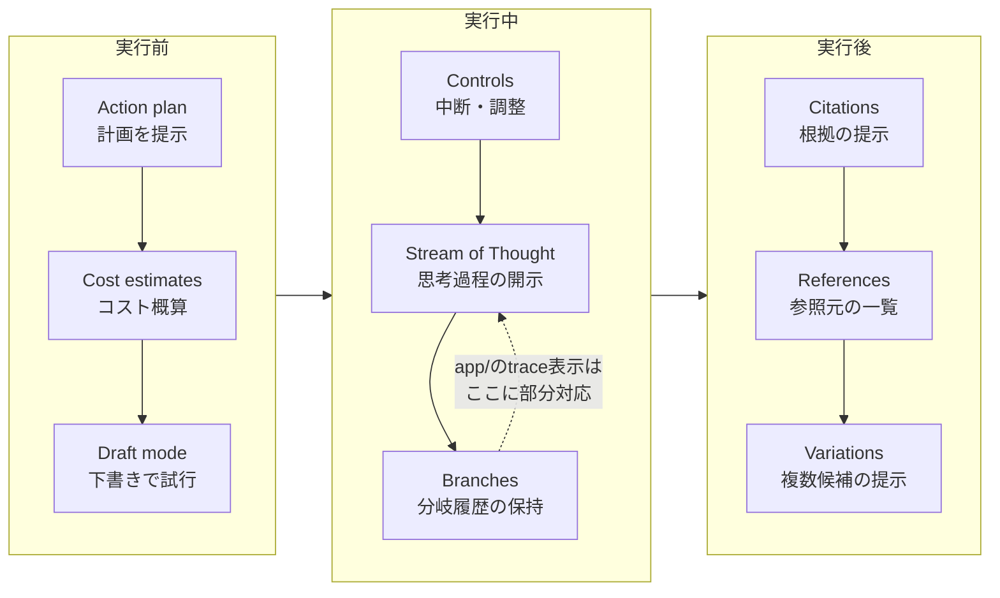
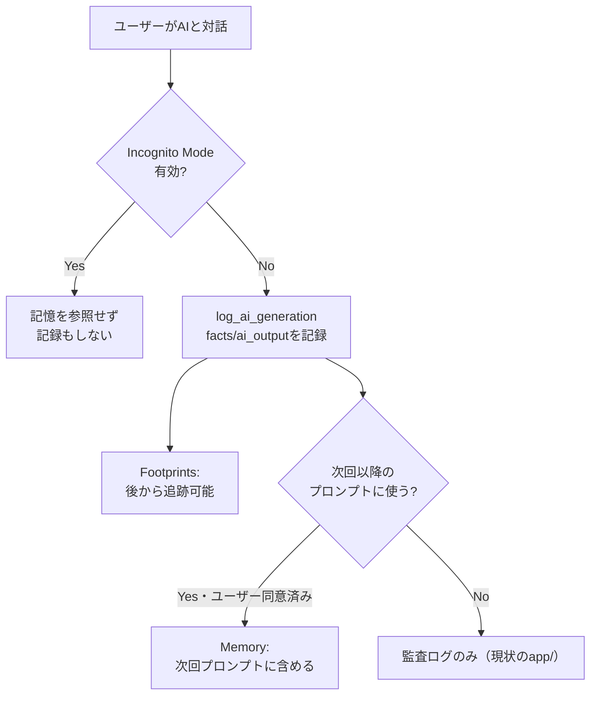
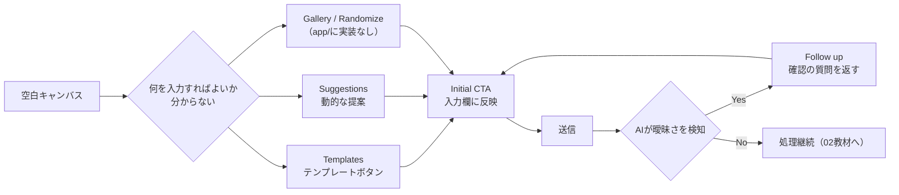
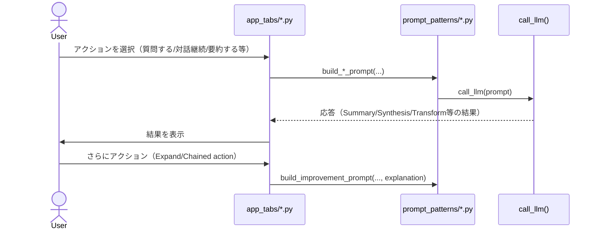
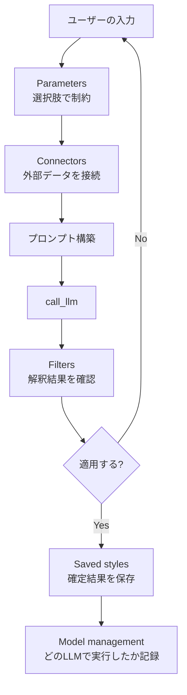
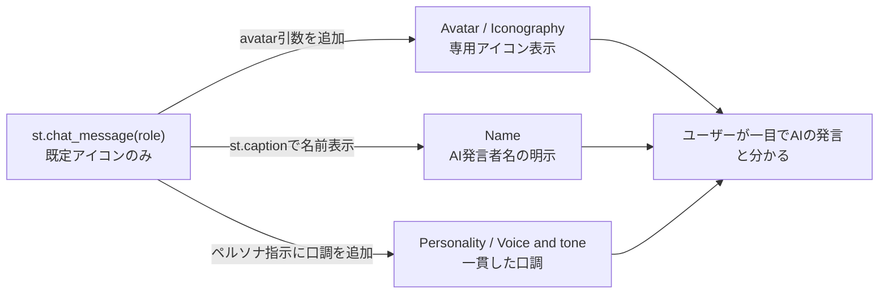

# Shape of AI 全パターンの体系的統合 Implementation Plan

> **For agentic workers:** REQUIRED SUB-SKILL: Use superpowers:subagent-driven-development (recommended) or superpowers:executing-plans to implement this plan task-by-task. Steps use checkbox (`- [ ]`) syntax for tracking.

**Goal:** 設計書（`docs/superpowers/specs/2026-08-13-shape-of-ai-pattern-catalog-design.md`）
に定義した、Shape of AI全57パターンの統合を実装する。04章
「Trust & Safety UX」に2教材（透明性と制御／記憶・プライバシー・来歴）を
追加し、新設07章「AI Product UX Patterns」に4教材を作成し、索引・参照
ファイル一式を更新する。

**Architecture:** Markdownのみの教材リポジトリ。既存の`tools/validate_docs.py`
（見出し順・Mermaidブロック・相互リンクを検証）を各タスクの完了確認に使う。

**Tech Stack:** Markdown、Mermaid（```mermaid コードブロック）、検証スクリプトは
Python標準ライブラリのみ。

**Spec:** `docs/superpowers/specs/2026-08-13-shape-of-ai-pattern-catalog-design.md`

## Global Constraints

- 個別教材ファイルは次の7見出しを**この文言・この順序**で使う（`00_STYLE_GUIDE.md` 2節）:
  `## この教材で身につくこと` / `## 概要` / `## 位置づけ` /
  `## 主要概念・設計判断の解説` / `## 実ソースコード（Python / プロンプト例、出典パス明記）` /
  `## 演習課題` / `## 理解度チェック`
- `app/` からの引用には出典パスを明記する（書式:
  「出典: `ai-stock-investing-tutorial/app/<path>`」を各コードブロック直前に置く）
- `app/`に実装例が無いパターンは、実ソースコード欄の該当箇所に「本教材の
  サンプルコードは`app/`に実装例が無いため、汎用サンプルコードで解説します。」
  の一文を明記する（`00_STYLE_GUIDE.md` 2節補足）
- 図はすべてMermaid形式の ```mermaid コードブロックで記載し、画像ファイルは作らない
- コードブロックには必ず言語指定を付ける（`python`, `bash`, `json`, `text`）
- 1文は60文字程度を目安に短く保つ
- 各ファイル末尾に前後リンク（`[← 前へ: ...](...)` / `[次へ: ... →](...)`）を置く
- 外部の確立された呼称（Shape of AIのパターン名）を引用する箇所は、
  `https://www.shapeof.ai/patterns/<slug>`（例:
  `https://www.shapeof.ai/patterns/verification`）へのリンクを付ける。
  個別パターンページのURLスラッグは英語パターン名を小文字ハイフン区切りに
  したもの（例: "Sample response" → `sample-response`、"Stream of Thought" →
  `stream-of-thought`）だが、執筆時に実際のURLが開けるか確認し、開けない
  場合はトップページ`https://www.shapeof.ai/`へのリンクに差し替える
- ai-stock-investing-tutorialの実ソースは
  `c:/Dev/tutorials/ai-stock-investing-tutorial/app/` 以下にある。本プランの
  コード引用はこの時点の実ファイルから書き起こし済みだが、執筆時に該当ファイルを
  開いて一言一句を再確認してから引用すること
- カテゴリ間リンク検証（`python tools/validate_docs.py`、引数無し）は、
  各タスクの完了確認では行わない（07章が完成するまで意図的にリンク切れが
  残るため）。各タスクは`--category`指定で確認し、全体のリンク検証は
  最終タスク（Task 8）でのみ行う
- 全コマンドは`genai-app-integration-tutorial`リポジトリのルート
  （`c:/Dev/tutorials/genai-app-integration-tutorial`）で実行する

---

### Task 1: 04章に「透明性と制御」教材を追加する

**Files:**
- Create: `docs/04-trust-and-safety-ux/05-transparency-and-control.md`

**Interfaces:**
- Consumes: なし
- Produces: `05-transparency-and-control.md`（Task 3で`00-README.md`の
  教材一覧・外部パターン対応、`04-prompt-injection-defense.md`の末尾ナビ
  から参照される）

- [ ] **Step 1: `05-transparency-and-control.md` を書く**

以下の内容で新規作成する。

```markdown
# 透明性と制御

## この教材で身につくこと

- AIの処理経過・実行計画をユーザーに開示するUXの設計判断を説明できる
- 「実行前の可視化」「実行中の制御」「結果の裏付け」という3つの局面で
  透明性パターンを分類できる
- `app/`のパイプライン実行トレースが、どの局面のどのパターンに部分的に
  対応するか説明できる

## 概要

AIに複数ステップの処理を任せると、ユーザーからは「何が起きているか」が
見えなくなりがちです。本教材では、[Shape of AI](https://www.shapeof.ai/)の
Governorsカテゴリのうち、確認ステップ（Verification）以外の9パターン
（Action plan, Branches, Citations, Controls, Cost estimates, Draft mode,
References, Stream of Thought, Variations）を、「実行前」「実行中」
「実行後」の3局面に整理して扱います。

## 位置づけ

本教材はカテゴリ04の5番目です。01（確認ステップ）が「実行直前に1回
確認する」ことに焦点を当てるのに対し、本教材は確認の前後を含めた
プロセス全体の透明性を扱います。

## 主要概念・設計判断の解説

### 3つの局面への整理

| 局面 | パターン | 目的 |
|---|---|---|
| 実行前 | Action plan, Cost estimates, Draft mode | 実行する前に計画・コスト・下書きを見せる |
| 実行中 | Controls, Stream of Thought, Branches | 実行中に制御・思考過程・分岐履歴を見せる |
| 実行後 | Citations, References, Variations | 結果の根拠・別候補を見せる |

### `app/`での部分的な対応: パイプライン実行トレース

AI戦略ビルダーのパイプライン実行は、実行**後**に「どのステップを
通過したか」を`trace`として開示します。これは[Stream of
Thought](https://www.shapeof.ai/patterns/stream-of-thought)（AIの思考過程・
ツール使用を開示する）に部分的に対応しますが、Shape of AIの定義が
「実行中のリアルタイム開示」を指すのに対し、`app/`の実装は「実行後の
事後報告」である点が異なります。この違いを認識した上で参考にしてください。

同様に、評価・改善ループ（Evaluator-Optimizer、05章参照）が
「AIによる自動改善を行いました」というキャプションと評価フィードバックを
表示する箇所も、実行後にプロセスの一部を開示する例です。

### `app/`に実装が無い観点: 実行前の透明性

Action plan（実行前に計画を提示）・Cost estimates（実行前にコスト概算を
提示）・Draft mode（低コストな下書きモードで試行）は、`app/`のパイプライン
実行が「ボタンを押すと即座に全ステップを実行する」設計のため、実装例が
ありません。本教材のサンプルコードは`app/`に実装例が無いため、汎用
サンプルコードで解説します。

複数ステップのAIパイプラインを実行する前に、ステップ一覧と概算コストを
提示し、ユーザーが実行前に把握できるようにする設計です。

## 実ソースコード（Python / プロンプト例、出典パス明記）

出典: `ai-stock-investing-tutorial/app/app_tabs/strategy_builder_tab.py`
（実行後のトレース開示、Stream of Thoughtに部分的に対応）

```python
result_df, trace = run_pipeline(strategy["steps"], all_tickers, CACHE_DIR)
st.session_state["strategy_pipeline_trace"] = trace
...
trace = st.session_state.get("strategy_pipeline_trace")
if trace:
    st.caption(" → ".join(trace))
```

出典: `ai-stock-investing-tutorial/app/app_tabs/strategy_builder_tab.py`
（実行後の改善プロセス開示、Stream of Thoughtに部分的に対応）

```python
if evaluation_result and evaluation_result["iterations"] > 0:
    st.caption("AIによる自動改善を行いました。")
    if evaluation_result["last_feedback"]:
        st.caption(f"評価フィードバック: {evaluation_result['last_feedback']}")
```

汎用サンプルコード（`app/`に実装例が無いため、実行前のAction plan・Cost
estimatesを解説する架空のコード）:

```python
def render_action_plan_preview(steps: list[dict]) -> bool:
    """複数ステップのAIパイプラインを実行する前に、ステップ一覧と
    概算コストを提示し、ユーザーが承認した場合のみ実行を許可する。
    """
    st.subheader("実行計画")
    for i, step in enumerate(steps, start=1):
        st.write(f"{i}. {step['description']}（想定LLM呼び出し回数: {step['llm_calls']}）")
    total_calls = sum(step["llm_calls"] for step in steps)
    st.caption(f"概算コスト: LLM呼び出し{total_calls}回")
    return st.button("この計画で実行する")
```



## 演習課題

1. `app/`のパイプライン実行トレース表示を、実行**前**の計画提示
   （Action plan）に変更するとしたら、`run_pipeline`の呼び出し順序を
   どう変える必要があるか説明してください。
2. 自分のアプリでコストが心配なAI機能を1つ想定し、実行前にCost
   estimatesを表示する設計を考えてください。

## 理解度チェック

- [ ] 透明性パターンを「実行前」「実行中」「実行後」の3局面で分類できる
- [ ] `app/`のトレース表示がStream of Thoughtとどう似ていて、どう違うか説明できる
- [ ] 実行前にAction plan・Cost estimatesを提示する設計を書ける

---

[← 前へ: プロンプトインジェクション対策](04-prompt-injection-defense.md) | [次へ: 記憶・プライバシー・来歴 →](06-memory-privacy-and-provenance.md)
```

- [ ] **Step 2: 検証スクリプトを実行する（見出し順のみ、Mermaid必須リストは未追加のためこの時点ではチェック対象外）**

Run: `python tools/validate_docs.py --category 04`
Expected: 既存ファイルの問題は無いこと（新規ファイルの見出し順違反があれば
ここで検出される。Mermaidブロック自体は書いてあるが、`MERMAID_REQUIRED`への
登録はTask 3で行うため、このタスク単体では検証対象に含まれない）

- [ ] **Step 3: Commit**

```bash
git add docs/04-trust-and-safety-ux/05-transparency-and-control.md
git commit -m "docs: 04章に透明性と制御教材を追加（Shape of AI Governors対応）"
```

---

### Task 2: 04章に「記憶・プライバシー・来歴」教材を追加する

**Files:**
- Create: `docs/04-trust-and-safety-ux/06-memory-privacy-and-provenance.md`

**Interfaces:**
- Consumes: なし
- Produces: `06-memory-privacy-and-provenance.md`（Task 3で`00-README.md`の
  教材一覧・外部パターン対応から参照される）

- [ ] **Step 1: `06-memory-privacy-and-provenance.md` を書く**

```markdown
# 記憶・プライバシー・来歴

## この教材で身につくこと

- AIとのやり取りを「事実」と「AI出力」に分けて記録する設計を実装できる
- Footprints（AIの手順を追跡できるようにする）パターンを実装できる
- Memory・Consent・Data ownership・Incognito Mode・Watermarkの各パターンの
  目的を説明できる

## 概要

[Shape of AI](https://www.shapeof.ai/)のGovernorsカテゴリのMemory・Shared
visionと、Trust Buildersカテゴリの5パターン（Consent, Data ownership,
Footprints, Incognito Mode, Watermark）を扱います。共通するテーマは
「AIが何を知っていて、何を記録し、ユーザーがそれをどう制御できるか」です。

## 位置づけ

本教材は04章の最終教材（6番目）です。01〜05で学んだ「実行前後の
透明性」に対し、本教材は「セッションをまたいだ記憶」「記録されたログへの
プライバシー配慮」という、より長期的な視点を扱います。

## 主要概念・設計判断の解説

### `app/`の実例: Footprints（AIの手順を追跡できるようにする）

[Footprints](https://www.shapeof.ai/patterns/footprints)は「ユーザーが
プロンプトから結果までのAIの手順を追跡できるようにする」パターンです。
`app/`の`log_ai_generation`は、LLM呼び出しごとに入力した事実情報
（`facts`）とAIの応答（`ai_output`）を分離してDBに記録し、`session_id`単位で
一連のやり取りを追跡可能にしています。これはFootprintsの実装例です。

### Memoryとの違い

Footprintsが「後から追跡できる記録」であるのに対し、
[Memory](https://www.shapeof.ai/patterns/memory)は「AIが**次回以降の
やり取りに使う**記憶」を指します。`app/`の`log_ai_generation`はあくまで
監査ログであり、記録した`facts`/`ai_output`を次回のプロンプトに
自動的に読み込んで使う仕組みはありません。したがって`app/`にMemory
パターンの実装例はありません。本教材のサンプルコードは`app/`に実装例が
無いため、汎用サンプルコードで解説します。

### `app/`に実装が無い観点: プライバシー配慮の4パターン

[Consent](https://www.shapeof.ai/patterns/consent)（第三者データを本人の
同意なく取り込まない）・[Data ownership](https://www.shapeof.ai/patterns/data-ownership)
（AIが記憶・利用するデータをユーザーが制御できる）・
[Incognito Mode](https://www.shapeof.ai/patterns/incognito-mode)（記憶に
残さずAIとやり取りできる）・[Watermark](https://www.shapeof.ai/patterns/watermark)
（AI生成物であることを機械可読な形で識別可能にする）は、`app/`に
該当する実装がありません。本教材のサンプルコードは`app/`に実装例が
無いため、汎用サンプルコードで解説します。

## 実ソースコード（Python / プロンプト例、出典パス明記）

出典: `ai-stock-investing-tutorial/app/common/ai_generation_log.py`
（Footprintsの実装例）

```python
def log_ai_generation(
    session_id: str,
    feature: str,
    facts: dict,
    prompt: str,
    ai_output: str,
    *,
    turn_index: int = 0,
    ticker: str | None = None,
    user_id: int | None = None,
    session_feature: str | None = None,
    session_factory=SessionLocal,
) -> None:
    with session_factory() as session:
        if session.get(AiSession, session_id) is None:
            session.add(
                AiSession(
                    id=session_id,
                    feature=session_feature or feature,
                    ticker=ticker,
                    user_id=user_id,
                )
            )
            session.flush()
        session.add(
            AiGeneration(
                session_id=session_id,
                turn_index=turn_index,
                feature=feature,
                facts=json.dumps(facts, ensure_ascii=False, default=str),
                prompt=prompt,
                ai_output=ai_output,
            )
        )
        session.commit()
```

`facts`（プログラムが計算した事実情報）と`ai_output`（AIの応答）を別列に
分離して記録する設計は、後から「AIが何を根拠に何を出力したか」を
追跡できるようにするFootprintsの核心です。

汎用サンプルコード（`app/`に実装例が無いため、Memory・Incognito Modeを
解説する架空のコード）:

```python
def build_prompt_with_memory(user_message: str, user_id: int) -> str:
    """ユーザーが許可した場合のみ、過去の記憶をプロンプトに含める。
    Incognito Modeが有効な場合は記憶を一切参照・記録しない。
    """
    if st.session_state.get("incognito_mode", False):
        return user_message  # 記憶を参照せず、この回のやり取りも記録しない

    remembered_facts = load_user_memory(user_id)  # ユーザーが同意したデータのみ
    if not remembered_facts:
        return user_message
    memory_context = "\n".join(f"- {fact}" for fact in remembered_facts)
    return f"【あなたについて記憶している情報】\n{memory_context}\n\n【今回のメッセージ】\n{user_message}"
```



## 演習課題

1. `log_ai_generation`が`facts`と`ai_output`を同じ列ではなく別々の列に
   分離して記録している理由を、Footprintsの目的に照らして説明してください。
2. 自分のアプリにMemoryパターンを追加するとしたら、ユーザーにどんな
   同意（Consent）の取り方をするべきか設計してください。

## 理解度チェック

- [ ] `ai_generation_log.py`がFootprintsパターンにどう対応するか説明できる
- [ ] FootprintsとMemoryの違いを説明できる
- [ ] Consent・Data ownership・Incognito Mode・Watermarkの目的をそれぞれ説明できる

---

[← 前へ: 透明性と制御](05-transparency-and-control.md) | [次へ: 05-agentic-workflow-patterns →](../05-agentic-workflow-patterns/00-README.md)
```

- [ ] **Step 2: 検証スクリプトを実行する**

Run: `python tools/validate_docs.py --category 04`
Expected: 見出し順の問題が無いこと（Mermaid必須リスト登録はTask 3）

- [ ] **Step 3: Commit**

```bash
git add docs/04-trust-and-safety-ux/06-memory-privacy-and-provenance.md
git commit -m "docs: 04章に記憶・プライバシー・来歴教材を追加（Shape of AI Governors/Trust Builders対応）"
```

---

### Task 3: 04章の索引・ナビゲーション・検証設定を更新する

**Files:**
- Modify: `docs/04-trust-and-safety-ux/00-README.md`
- Modify: `docs/04-trust-and-safety-ux/01-verification-checkpoint.md:94`（理解度チェック直後は変更しない。追記は「主要概念・設計判断の解説」内）
- Modify: `docs/04-trust-and-safety-ux/03-guardrails-and-disclaimers.md`
- Modify: `docs/04-trust-and-safety-ux/04-prompt-injection-defense.md:144`（末尾ナビ）
- Modify: `tools/validate_docs.py`（`MERMAID_REQUIRED`に2件追加）

**Interfaces:**
- Consumes: Task 1・2で作成した`05-transparency-and-control.md`・
  `06-memory-privacy-and-provenance.md`
- Produces: 04章内のナビゲーション一貫性、`validate_docs.py`が新規2ファイルの
  Mermaidブロックを検証対象に含める

- [ ] **Step 1: `00-README.md`の学習目標・教材一覧・外部パターン対応を更新する**

「## 学習目標」の末尾に2点追加:

```markdown
- AIの処理経過・実行計画を開示し、ユーザーが制御できるUXを設計できる
- AIが何を記憶・記録するかを設計し、プライバシーに配慮したUXを実装できる
```

「## 教材一覧」表に2行追加:

```markdown
| 05 | [透明性と制御](05-transparency-and-control.md) | 実行前後のAI処理をユーザーに開示・制御させる設計 |
| 06 | [記憶・プライバシー・来歴](06-memory-privacy-and-provenance.md) | AIの記憶・記録とプライバシー配慮の設計 |
```

「## 外部パターン対応」節全体を次に置き換える:

```markdown
## 外部パターン対応

[Shape of AI](https://www.shapeof.ai/)のGovernors（13パターン）・Trust
Builders（7パターン）の全20パターンが、本章6教材のいずれかに対応します。

| Shape of AIカテゴリ | パターン | 対応教材 |
|---|---|---|
| Governors | [Verification](https://www.shapeof.ai/patterns/verification) | [01-verification-checkpoint.md](01-verification-checkpoint.md) |
| Governors | [Sample response](https://www.shapeof.ai/patterns/sample-response) | [01-verification-checkpoint.md](01-verification-checkpoint.md) |
| Trust Builders | [Caveat](https://www.shapeof.ai/patterns/caveat) | [03-guardrails-and-disclaimers.md](03-guardrails-and-disclaimers.md) |
| Trust Builders | [Disclosure](https://www.shapeof.ai/patterns/disclosure) | [03-guardrails-and-disclaimers.md](03-guardrails-and-disclaimers.md) |
| Governors | Action plan, Branches, Citations, Controls, Cost estimates, Draft mode, References, Stream of Thought, Variations | [05-transparency-and-control.md](05-transparency-and-control.md) |
| Governors | Memory, Shared vision | [06-memory-privacy-and-provenance.md](06-memory-privacy-and-provenance.md) |
| Trust Builders | Consent, Data ownership, Footprints, Incognito Mode, Watermark | [06-memory-privacy-and-provenance.md](06-memory-privacy-and-provenance.md) |

事実とAI考察の分離（02章）・プロンプトインジェクション対策（04章）は、
Shape of AIに直接対応するパターン名が無いため対応表から除く。
```

- [ ] **Step 2: `01-verification-checkpoint.md`にSample responseの補足を追記する**

「### Verificationパターンとは」節の末尾（「という段階分け）があります。」の
直後）に1段落追加:

```markdown

近い概念として[Sample response](https://www.shapeof.ai/patterns/sample-response)
（複雑なプロンプトに対してユーザーの意図を確認する）があります。
Verificationが「AIの出力を実行前に確認する」ことに焦点を当てるのに対し、
Sample responseは「複雑な依頼内容をAIがどう解釈したか」を確認する点に
焦点があり、`app/`のスクリーニング条件確認はこの両方の性質を兼ねています。
```

- [ ] **Step 3: `03-guardrails-and-disclaimers.md`にCaveat/Disclosureの対応を追記する**

「## 概要」節の末尾（二層構造の説明の直後）に1段落追加:

```markdown

本教材が扱う免責事項の機械的付与は、[Shape of AI](https://www.shapeof.ai/)の
[Caveat](https://www.shapeof.ai/patterns/caveat)（モデル・技術の限界や
リスクをユーザーに伝える）と[Disclosure](https://www.shapeof.ai/patterns/disclosure)
（AIが関与したコンテンツ・やり取りであることを明示する）の両方に対応します。
```

- [ ] **Step 4: `04-prompt-injection-defense.md`の末尾ナビを更新する**

現在の末尾:

```text
[← 前へ: ガードレールと免責事項](03-guardrails-and-disclaimers.md) | [次へ: 05-agentic-workflow-patterns →](../05-agentic-workflow-patterns/00-README.md)
```

を次に変更する（「前へ」は変更不要）:

```text
[← 前へ: ガードレールと免責事項](03-guardrails-and-disclaimers.md) | [次へ: 透明性と制御 →](05-transparency-and-control.md)
```

- [ ] **Step 5: `tools/validate_docs.py`の`MERMAID_REQUIRED`に2件追加する**

`MERMAID_REQUIRED`セットの`("04-trust-and-safety-ux", "04-prompt-injection-defense.md"),`
の行の直後に追加:

```python
    ("04-trust-and-safety-ux", "05-transparency-and-control.md"),
    ("04-trust-and-safety-ux", "06-memory-privacy-and-provenance.md"),
```

- [ ] **Step 6: 検証スクリプトを実行する**

Run: `python tools/validate_docs.py --category 04`
Expected: `OK: 問題は見つかりませんでした`

- [ ] **Step 7: Commit**

```bash
git add docs/04-trust-and-safety-ux/00-README.md \
        docs/04-trust-and-safety-ux/01-verification-checkpoint.md \
        docs/04-trust-and-safety-ux/03-guardrails-and-disclaimers.md \
        docs/04-trust-and-safety-ux/04-prompt-injection-defense.md \
        tools/validate_docs.py
git commit -m "docs: 04章の外部パターン対応を拡充しナビゲーションを更新"
```

---

### Task 4: 07章を新設し「オンボーディングと導線」教材を作成する

**Files:**
- Create: `docs/07-ai-product-ux-patterns/00-README.md`
- Create: `docs/07-ai-product-ux-patterns/01-onboarding-and-wayfinding.md`

**Interfaces:**
- Consumes: なし
- Produces: `docs/07-ai-product-ux-patterns/`ディレクトリ、Task 5〜8が参照する
  カテゴリREADMEの土台

- [ ] **Step 1: `00-README.md`を書く**

```markdown
# 07. AI Product UX Patterns - AIプロダクトのUXパターン

01〜06章が「AIをどう呼び出すか」という統合設計を扱うのに対し、本章は
「ユーザーがAI機能をどう使い始め、どう操作し、どう調整するか」という
UI/UXレベルの設計パターンを扱います。

[Shape of AI](https://www.shapeof.ai/)の6カテゴリのうち、04章が扱う
Governors/Trust Builders（信頼・安全性）を除く4カテゴリ（Wayfinders /
Prompt Actions / Tuners / Identifiers、計37パターン）に対応します。

## 学習目標

- 初回プロンプト体験（テンプレート・提案）の空白キャンバス対策を設計できる
- ユーザーがAIに指示するアクション（開いた入力・対話継続等）を設計できる
- フィルタ・保存済みプリセット・モデル選択によるプロンプト調整UXを設計できる
- AIの存在をUI上で識別可能にする表現（命名・トーン等）を設計できる

## 教材一覧

| # | 教材 | 内容 |
|---|------|------|
| 01 | [オンボーディングと導線](01-onboarding-and-wayfinding.md) | 初回プロンプト体験の空白キャンバス対策 |
| 02 | [プロンプト操作アクション](02-prompt-action-patterns.md) | ユーザーがAIに指示する各種アクション |
| 03 | [調整とコンテキスト制御](03-tuning-and-context-control.md) | フィルタ・プリセット・モデル選択によるプロンプト調整 |
| 04 | [AIの識別とブランディング](04-ai-identity-and-branding.md) | AIの存在をUI上で識別可能にする表現 |

## 外部パターン対応

| Shape of AIカテゴリ | パターン | 対応教材 |
|---|---|---|
| [Wayfinders](https://www.shapeof.ai/) | Gallery, Follow up, Initial CTA, Nudges, Prompt details, Randomize, Suggestions, Templates（計8） | [01-onboarding-and-wayfinding.md](01-onboarding-and-wayfinding.md) |
| [Prompt Actions](https://www.shapeof.ai/) | Auto-fill, Chained action, Describe, Expand, Inline Action, Inpainting, Madlibs, Open input, Regenerate, Restructure, Restyle, Summary, Synthesis, Transform（計14） | [02-prompt-action-patterns.md](02-prompt-action-patterns.md) |
| [Tuners](https://www.shapeof.ai/) | Attachments, Connectors, Filters, Model management, Modes, Parameters, Preset styles, Prompt enhancer, Saved styles, Voice and tone（計10） | [03-tuning-and-context-control.md](03-tuning-and-context-control.md) |
| [Identifiers](https://www.shapeof.ai/) | Avatar, Color, Iconography, Name, Personality（計5） | [04-ai-identity-and-branding.md](04-ai-identity-and-branding.md) |

Shape of AIのGovernors/Trust Buildersは[04-trust-and-safety-ux](../04-trust-and-safety-ux/00-README.md)で扱います。

## 章の方針

`app/`に実装がある観点（テンプレート・提案・オープン入力・フィルタ確認・
戦略の保存/読込・LLMプロバイダ切替等）は実ソースコードを引用します。
実装が無い観点（Identifiers全般、Prompt Actionsの一部等）は、その旨を
明記した上で汎用サンプルコードで解説します。

---

[← 前へ: 06-real-world-case-study](../06-real-world-case-study/00-README.md)
```

- [ ] **Step 2: `01-onboarding-and-wayfinding.md`を書く**

```markdown
# オンボーディングと導線

## この教材で身につくこと

- 空白キャンバス問題への対策（テンプレート・提案）を設計できる
- 初回プロンプトを促すCTA（Call To Action）を設計できる
- AIが曖昧な入力に対して確認・提案で返す「Follow up」設計を実装できる

## 概要

ユーザーが何も入力されていない画面（空白キャンバス）を前にすると、
何を入力すればいいか分からず離脱しがちです。本教材では、[Shape of
AI](https://www.shapeof.ai/)のWayfindersカテゴリ8パターン（Gallery, Follow
up, Initial CTA, Nudges, Prompt details, Randomize, Suggestions,
Templates）を、「空白キャンバス対策」と「入力ガイダンス」の2グループに
整理して扱います。

## 位置づけ

07章の1番目の教材です。ここで学ぶ導線設計は、02教材で扱う「入力後の
アクション」の前段階、つまりユーザーが最初のプロンプトを送るまでの
体験を扱います。

## 主要概念・設計判断の解説

### 空白キャンバス対策: Templates・Suggestions

AI戦略ビルダーの投資アイデア入力欄は、あらかじめ用意した
[Templates](https://www.shapeof.ai/patterns/templates)（テンプレート
ボタン）と、その日の値上がり銘柄から動的に生成する
[Suggestions](https://www.shapeof.ai/patterns/suggestions)（提案）の
両方を用意し、何も思いつかないユーザーでも入力を始められるようにして
います。

### 入力ガイダンス: Initial CTA・Follow up

投資アイデア入力欄自体は、プレースホルダー付きの大きな`st.text_area`
（[Initial CTA](https://www.shapeof.ai/patterns/initial-cta)）です。
入力後、AIは曖昧なアイデアに対してすぐ確定させず、財務指標や閾値を
具体化する質問・提案を返します。これは[Follow up](https://www.shapeof.ai/patterns/follow-up)
（初期プロンプトが不十分な場合に追加情報を引き出す）に対応します。

### `app/`に実装が無い観点: Gallery・Nudges・Prompt details・Randomize

[Gallery](https://www.shapeof.ai/patterns/gallery)（生成例・プロンプト例の
共有）・[Nudges](https://www.shapeof.ai/patterns/nudges)（利用可能な操作への
気づきを促す）・[Prompt details](https://www.shapeof.ai/patterns/prompt-details)
（裏側で実際に何が起きているかを見せる）・[Randomize](https://www.shapeof.ai/patterns/randomize)
（低い障壁で試させるランダム生成）は、`app/`に該当する実装がありません。
本教材のサンプルコードは`app/`に実装例が無いため、汎用サンプルコードで
解説します。

## 実ソースコード（Python / プロンプト例、出典パス明記）

出典: `ai-stock-investing-tutorial/app/app_tabs/strategy_builder_tab.py`
（Templates）

```python
_TEMPLATES = {
    "バリュー株": "PERが低く、PBRも割安な銘柄に投資したい。",
    "グロース株": "売上高の伸び率が高く、将来性のある成長株に投資したい。",
    "配当株": "配当利回りが高く、安定した配当が期待できる銘柄に投資したい。",
}

template_cols = st.columns(len(_TEMPLATES))
for col, (label, template_text) in zip(template_cols, _TEMPLATES.items()):
    with col:
        if st.button(label, key=f"strategy_template_{label}"):
            st.session_state["strategy_idea_text"] = template_text
            st.rerun()
```

出典: `ai-stock-investing-tutorial/app/app_tabs/strategy_builder_tab.py`
（Suggestions、業種ローテーション分析からの提案）

```python
watchlist = build_watchlist_from_rotation(...)
if watchlist["idea_text"] is None:
    st.info("十分な確信度を持つ業種間の関係が見つかりませんでした。")
    return
st.write(watchlist["idea_text"])
if st.button("この案をアイデア欄に反映", key="strategy_apply_watchlist_idea"):
    st.session_state["strategy_idea_text"] = watchlist["idea_text"]
    st.rerun()
```

出典: `ai-stock-investing-tutorial/app/app_tabs/strategy_builder_tab.py`
（Initial CTA）

```python
st.text_area(
    "投資アイデア",
    key="strategy_idea_text",
    placeholder="例: PERが低く、ROEが高い成長株に投資したい",
    height=100,
)
if st.button("対話を始める", disabled=not st.session_state.get("strategy_idea_text")):
    st.session_state["strategy_chat_history"] = [
        {"role": "user", "content": st.session_state["strategy_idea_text"]}
    ]
```

出典: `ai-stock-investing-tutorial/app/prompt_patterns/strategy_dialogue.py`
（Follow up、ステップ1の指示文）

```text
【ステップ1: アイデアの定量化】
ユーザーから「考え方」が入力されたら、それを歓迎し、以下の要素を具体化するための質問や提案を
1〜2個、短く行ってください。
1. 使用する財務指標（例: PER, PBR, ROE, DIVIDEND_YIELD, REVENUE_GROWTH のいずれか）
2. 具体的な数値の閾値（例: PBR 1倍未満、ROE 10%以上など）
このステップでは、説明文以外は出力しないでください。JSON形式は使わないでください。
```

汎用サンプルコード（`app/`に実装例が無いため、Gallery・Randomizeを
解説する架空のコード）:

```python
def render_gallery_and_randomize(examples: list[dict]) -> str | None:
    """過去の生成例（Gallery）と、ランダムに1件選んで試させるボタン
    （Randomize）を並べて表示する。選ばれた例のプロンプトを返す。
    """
    st.subheader("こんな使い方ができます")
    for example in examples[:3]:
        st.caption(f"「{example['prompt']}」→ {example['result_summary']}")
    if st.button("ランダムに試す"):
        import random
        return random.choice(examples)["prompt"]
    return None
```



## 演習課題

1. `_TEMPLATES`のようなテンプレートボタンと、業種ローテーションからの
   動的な提案（Suggestions）は、どちらも入力欄を埋める点で似ています。
   ユーザー体験上の違いを1つ挙げてください。
2. 自分のアプリでAI機能への入り口を1つ想定し、Templates・Suggestions・
   Initial CTAのうちどれを使うべきか、理由とともに設計してください。

## 理解度チェック

- [ ] 空白キャンバス問題とは何か説明できる
- [ ] `app/`のTemplates・Suggestions・Initial CTA・Follow upの実装を説明できる
- [ ] Gallery・Nudges・Prompt details・Randomizeの目的をそれぞれ説明できる

---

[← 前へ: 00-README](00-README.md) | [次へ: プロンプト操作アクション →](02-prompt-action-patterns.md)
```

- [ ] **Step 3: 検証スクリプトを実行する**

Run: `python tools/validate_docs.py --category 07`
Expected: 見出し順の問題が無いこと（Mermaid必須リスト登録はTask 7）

- [ ] **Step 4: Commit**

```bash
git add docs/07-ai-product-ux-patterns/00-README.md \
        docs/07-ai-product-ux-patterns/01-onboarding-and-wayfinding.md
git commit -m "docs: 07章を新設しオンボーディングと導線教材を追加"
```

---

### Task 5: 07章に「プロンプト操作アクション」教材を追加する

**Files:**
- Create: `docs/07-ai-product-ux-patterns/02-prompt-action-patterns.md`

**Interfaces:**
- Consumes: Task 4で作成した`00-README.md`（教材一覧に既にリンクあり）
- Produces: `02-prompt-action-patterns.md`

- [ ] **Step 1: `02-prompt-action-patterns.md`を書く**

```markdown
# プロンプト操作アクション

## この教材で身につくこと

- ユーザーがAIに指示する典型的なアクション（開いた入力・対話継続・要約・
  拡張等）を、目的別に分類できる
- 既存の分析結果を入力として次のAI呼び出しに渡す「Chained action」を実装できる
- `app/`のどの機能がどのPrompt Actionsパターンに対応するか説明できる

## 概要

[Shape of AI](https://www.shapeof.ai/)のPrompt Actionsカテゴリ14パターン
（Auto-fill, Chained action, Describe, Expand, Inline Action, Inpainting,
Madlibs, Open input, Regenerate, Restructure, Restyle, Summary, Synthesis,
Transform）を、`app/`の実装に対応するものと、対応しないものに分けて
扱います。

## 位置づけ

07章の2番目の教材です。01教材（導線）で最初のプロンプトを送った後、
ユーザーがAIに対して行う様々な操作アクションを扱います。

## 主要概念・設計判断の解説

### `app/`の実例（7パターン）

| パターン | `app/`での対応 |
|---|---|
| [Open input](https://www.shapeof.ai/patterns/open-input) | AI質問箱の自由記述入力（`qa_tab.py`） |
| [Chained action](https://www.shapeof.ai/patterns/chained-action) | 戦略ビルダーの対話継続（`st.chat_input`で追加発言） |
| [Auto-fill](https://www.shapeof.ai/patterns/auto-fill) | 提案結果を投資アイデア入力欄へ反映（単一フィールド版） |
| [Summary](https://www.shapeof.ai/patterns/summary) | バックテスト結果を初心者向けに要約説明 |
| [Expand](https://www.shapeof.ai/patterns/expand) | 既存の解説に追加の検討観点を加える（Prompt Chaining 2段目） |
| [Synthesis](https://www.shapeof.ai/patterns/synthesis) | ポートフォリオの事実データから観察事項を箇条書きに整理 |
| [Transform](https://www.shapeof.ai/patterns/transform) | ランキング結果（構造化データ）を銘柄ごとの一言コメント（文章）に変換 |

### `app/`に実装が無い観点（7パターン）

[Describe](https://www.shapeof.ai/patterns/describe)（対象を基本要素に
分解しプロンプト候補を示す）・[Inline Action](https://www.shapeof.ai/patterns/inline-action)
（画面上の既存コンテンツを起点にAIへ問い合わせる）・
[Inpainting](https://www.shapeof.ai/patterns/inpainting)（結果の一部だけを
再生成する）・[Madlibs](https://www.shapeof.ai/patterns/madlibs)（同じ
書式のまま繰り返し生成する）・[Regenerate](https://www.shapeof.ai/patterns/regenerate)
（追加入力なしで再生成する）・[Restructure](https://www.shapeof.ai/patterns/restructure)
（既存コンテンツを起点にプロンプトを組み立てる）・
[Restyle](https://www.shapeof.ai/patterns/restyle)（構造を変えずスタイルだけ
変換する）は、`app/`に該当する実装がありません。本教材のサンプルコードは
`app/`に実装例が無いため、汎用サンプルコードで解説します。

## 実ソースコード（Python / プロンプト例、出典パス明記）

出典: `ai-stock-investing-tutorial/app/app_tabs/qa_tab.py`（Open input）

```python
ticker = st.text_input("銘柄コード（任意）", placeholder="7203.T", key="qa_ticker")
question = st.text_area(
    "質問", placeholder="この銘柄は割安ですか？", key="qa_question"
)
if not st.button("質問する", disabled=not question):
    return
```

出典: `ai-stock-investing-tutorial/app/app_tabs/strategy_builder_tab.py`
（Chained action、対話の継続）

```python
user_reply = st.chat_input("AIへの返信を入力", key="strategy_chat_input")
if user_reply:
    history.append({"role": "user", "content": user_reply})
    st.session_state["strategy_chat_history"] = history
    st.rerun()
```

出典: `ai-stock-investing-tutorial/app/prompt_patterns/backtest_explanation.py`
（Summary、複雑な数値結果を初心者向けに要約）

```python
return (
    f"以下は{strategy_name}戦略のバックテスト結果です"
    "（Python側でパラメータの近傍グリッドサーチまで計算済みのため再計算は不要です）。\n\n"
    ...
    "この結果を投資初心者にも分かる言葉で説明してください。\n"
)
```

出典: `ai-stock-investing-tutorial/app/prompt_patterns/backtest_explanation.py`
（Expand、既存の解説に追加の観点を加える2段目のプロンプト）

```python
def build_improvement_prompt(
    ticker: str, comparison: dict, explanation: str, stability: dict, ...
) -> str:
    # Step1（結果解説）の出力を入力として受け取り、追加で検討すべき観点を
    # 生成させる2段階目のプロンプト（Prompt Chaining）。
    return (
        f"...\n【既存の解説】\n{explanation}\n\n"
        "この解説を踏まえ、投資家が追加で検討する価値がある観点を"
        "日本語で2〜3個、簡潔に提案してください。\n"
    )
```

出典: `ai-stock-investing-tutorial/app/prompt_patterns/report_generation.py`
（Synthesis、事実データを観察事項に整理）

```python
return (
    "以下はポートフォリオの事実データ（Python側で計算済み）です。\n\n"
    f"{facts_json}\n\n"
    "このデータを見て、教育的な観察事項（例: 集中度が高い銘柄、"
    "ニュースセンチメントが弱い銘柄、テクニカルシグナルが弱含みの銘柄）を"
    "箇条書きで示してください。\n"
)
```

出典: `ai-stock-investing-tutorial/app/prompt_patterns/backtest_explanation.py`
（Transform、構造化ランキングを文章コメントへ変換）

```python
def build_ranking_comment_prompt(ranking_rows: list[dict]) -> str:
    rows_json = json.dumps(rows, ensure_ascii=False)
    return (
        "以下は複数銘柄のバックテスト結果ランキング（リスク調整済みリターン降順）です。"
        "銘柄ごとに投資家向けの一言コメントを日本語で1文ずつ作成してください。"
        '出力形式: {"<ticker>": "<コメント>"} というJSONのみを出力してください。\n\n'
        f"{rows_json}"
    )
```

汎用サンプルコード（`app/`に実装例が無いため、Regenerate・Inline Actionを
解説する架空のコード）:

```python
def render_regenerate_and_inline_action(last_prompt: str, selected_text: str | None) -> str | None:
    """同じプロンプトのまま結果だけ再生成する（Regenerate）ボタンと、
    画面上で選択済みのテキストを起点にAIへ問い合わせる（Inline Action）
    ボタンを並べて表示する。
    """
    col1, col2 = st.columns(2)
    with col1:
        if st.button("再生成する（同じ条件で）"):
            return last_prompt
    with col2:
        if selected_text and st.button(f"「{selected_text}」について聞く"):
            return f"次のテキストについて詳しく説明してください: {selected_text}"
    return None
```



## 演習課題

1. `build_improvement_prompt`がExpandパターンに対応する理由を、
   「既存の出力を入力として使う」という観点で説明してください。
2. 自分のアプリの既存出力に対して、Regenerate（同条件で再生成）と
   Restyle（構造は変えずスタイルだけ変更）のどちらを追加すべきか、
   ユースケースを1つ想定して判断してください。

## 理解度チェック

- [ ] `app/`が実装する7つのPrompt Actionsパターンをそれぞれ説明できる
- [ ] Expand（既存出力を入力にする）とSummary（複雑な結果を要約する）の違いを説明できる
- [ ] Describe・Inline Action・Inpainting・Madlibs・Regenerate・Restructure・
      Restyleの目的をそれぞれ説明できる

---

[← 前へ: オンボーディングと導線](01-onboarding-and-wayfinding.md) | [次へ: 調整とコンテキスト制御 →](03-tuning-and-context-control.md)
```

- [ ] **Step 2: 検証スクリプトを実行する**

Run: `python tools/validate_docs.py --category 07`
Expected: 見出し順の問題が無いこと

- [ ] **Step 3: Commit**

```bash
git add docs/07-ai-product-ux-patterns/02-prompt-action-patterns.md
git commit -m "docs: 07章にプロンプト操作アクション教材を追加"
```

---

### Task 6: 07章に「調整とコンテキスト制御」教材を追加する

**Files:**
- Create: `docs/07-ai-product-ux-patterns/03-tuning-and-context-control.md`

**Interfaces:**
- Consumes: Task 4で作成した`00-README.md`
- Produces: `03-tuning-and-context-control.md`

- [ ] **Step 1: `03-tuning-and-context-control.md`を書く**

```markdown
# 調整とコンテキスト制御

## この教材で身につくこと

- AIが解釈した条件をユーザーに確認させながら適用するFilters設計を実装できる
- ユーザー固有の設定（保存済み戦略、LLMプロバイダ選択）を永続化する
  Saved styles・Model managementを実装できる
- Attachments・Modes・Preset styles・Prompt enhancer・Voice and toneの
  目的を説明できる

## 概要

[Shape of AI](https://www.shapeof.ai/)のTunersカテゴリ10パターン
（Attachments, Connectors, Filters, Model management, Modes, Parameters,
Preset styles, Prompt enhancer, Saved styles, Voice and tone）を扱います。
共通するテーマは「プロンプトそのものではなく、その前後の設定・文脈を
調整する」ことです。

## 位置づけ

07章の3番目の教材です。02教材（プロンプト操作アクション）が「1回の
やり取りの中でのアクション」を扱うのに対し、本教材は「やり取りの
前提となる設定・文脈」を扱います。

## 主要概念・設計判断の解説

### `app/`の実例（5パターン）

| パターン | `app/`での対応 |
|---|---|
| [Filters](https://www.shapeof.ai/patterns/filters) | AIが解釈した絞り込み条件を`st.json`で確認してから適用 |
| [Parameters](https://www.shapeof.ai/patterns/parameters) | 分析期間（`st.selectbox(["1y", "2y"])`）等の制約付きパラメータ |
| [Connectors](https://www.shapeof.ai/patterns/connectors) | 質問カテゴリに応じて外部データ（株価・ニュース）をプロンプトに接続 |
| [Saved styles](https://www.shapeof.ai/patterns/saved-styles) | ユーザーが確定した戦略条件をDBに保存し再利用 |
| [Model management](https://www.shapeof.ai/patterns/model-management) | `llm_provider`設定でClaude CLI/OpenAI APIを切り替え |

### `app/`に実装が無い観点（5パターン）

[Attachments](https://www.shapeof.ai/patterns/attachments)（ファイル等を
添付してAIの参照材料にする）・[Modes](https://www.shapeof.ai/patterns/modes)
（用途に応じてAIの制約・ペルソナを切り替える）・
[Preset styles](https://www.shapeof.ai/patterns/preset-styles)（生成物の
質感・トーンの既定オプション）・[Prompt enhancer](https://www.shapeof.ai/patterns/prompt-enhancer)
（ユーザーのプロンプトをAIが補強する）・
[Voice and tone](https://www.shapeof.ai/patterns/voice-and-tone)（出力の
声・トーンを一貫させる）は、`app/`に該当する実装がありません。本教材の
サンプルコードは`app/`に実装例が無いため、汎用サンプルコードで解説します。

## 実ソースコード（Python / プロンプト例、出典パス明記）

出典: `ai-stock-investing-tutorial/app/app_tabs/screening_tab.py`（Filters）

```python
st.subheader("AIが解釈した条件（適用前に確認してください）")
st.json(filters)
if st.button("この条件で絞り込む"):
    result_df = apply_filters(universe_df, filters)
```

出典: `ai-stock-investing-tutorial/app/app_tabs/strategy_builder_tab.py`
（Parameters、制約付き選択肢）

```python
sector_period = st.selectbox(
    "分析期間", ["1y", "2y"], key="strategy_sector_period"
)
band_choice = st.selectbox(
    "周期帯",
    ["すべて（自動選択）", "短期", "中期", "長期"],
    key="strategy_watchlist_band",
)
```

出典: `ai-stock-investing-tutorial/app/app_tabs/qa_tab.py`（Connectors、
質問カテゴリに応じた外部データの接続）

```python
if category == "technical":
    history = cached_fetch_price_history(ticker, "6mo")
    technical = analyze_technical(history)
    prompt = build_technical_answer_prompt(question, technical)
elif category == "news":
    news = cached_fetch_news(ticker)
    prompt = build_news_answer_prompt(question, news)
```

出典: `ai-stock-investing-tutorial/app/strategy_builder/storage.py`
（Saved styles）

```python
def load_strategies(user_id: int, session_factory=SessionLocal) -> list[dict]:
    with session_factory() as session:
        rows = (
            session.query(Strategy)
            .filter_by(user_id=user_id)
            .order_by(Strategy.id)
            .all()
        )
        return [json.loads(row.strategy_json) for row in rows]


def save_strategy(user_id: int, strategy: dict, session_factory=SessionLocal) -> None:
    name = strategy.get("strategy_name")
    with session_factory() as session:
        session.query(Strategy).filter_by(user_id=user_id, strategy_name=name).delete()
        session.add(
            Strategy(
                user_id=user_id,
                strategy_name=name,
                strategy_json=json.dumps(strategy, ensure_ascii=False),
            )
        )
        session.commit()
```

出典: `ai-stock-investing-tutorial/app/data_api/llm_client.py`（Model
management）

```python
def _get_provider() -> str:
    return (_get_secret("llm_provider", "claude_cli") or "claude_cli").strip().lower()


def call_llm(prompt: str, timeout: int = 120) -> str:
    provider = _get_provider()
    if provider == "claude_cli":
        return _call_claude_cli(prompt, timeout)
    elif provider == "openai":
        return _call_openai(prompt, timeout)
    else:
        raise ValueError(f"未対応のllm_providerです: {provider}")
```

汎用サンプルコード（`app/`に実装例が無いため、Modes・Voice and toneを
解説する架空のコード）:

```python
def build_prompt_with_mode(user_message: str, mode: str) -> str:
    """用途（Modes）に応じてAIのペルソナ・制約・声のトーン
    （Voice and tone）を切り替える。
    """
    mode_instructions = {
        "初心者向け": "専門用語を避け、やさしい言葉で丁寧に説明してください。",
        "専門家向け": "専門用語を積極的に使い、簡潔に要点だけ述べてください。",
    }
    instruction = mode_instructions.get(mode, mode_instructions["初心者向け"])
    return f"{instruction}\n\n{user_message}"
```



## 演習課題

1. `save_strategy`が同名戦略を「削除→追加」で上書きしている理由を、
   Saved stylesが目指す「再利用しやすさ」の観点で説明してください。
2. 自分のアプリにModel management（複数LLMプロバイダの切り替え）を
   追加するとしたら、`llm_client.py`の`_get_provider`をどう拡張するか
   考えてください。

## 理解度チェック

- [ ] `app/`が実装する5つのTunersパターンをそれぞれ説明できる
- [ ] FiltersとVerification（04章）の違いを説明できる
- [ ] Attachments・Modes・Preset styles・Prompt enhancer・Voice and toneの
      目的をそれぞれ説明できる

---

[← 前へ: プロンプト操作アクション](02-prompt-action-patterns.md) | [次へ: AIの識別とブランディング →](04-ai-identity-and-branding.md)
```

- [ ] **Step 2: 検証スクリプトを実行する**

Run: `python tools/validate_docs.py --category 07`
Expected: 見出し順の問題が無いこと

- [ ] **Step 3: Commit**

```bash
git add docs/07-ai-product-ux-patterns/03-tuning-and-context-control.md
git commit -m "docs: 07章に調整とコンテキスト制御教材を追加"
```

---

### Task 7: 07章に「AIの識別とブランディング」教材を追加し検証設定を仕上げる

**Files:**
- Create: `docs/07-ai-product-ux-patterns/04-ai-identity-and-branding.md`
- Modify: `tools/validate_docs.py`（`MERMAID_REQUIRED`に07章4件を追加）

**Interfaces:**
- Consumes: Task 4〜6で作成した07章の各ファイル
- Produces: `04-ai-identity-and-branding.md`、07章全体がvalidate_docs.pyの
  Mermaid検証対象になる

- [ ] **Step 1: `04-ai-identity-and-branding.md`を書く**

```markdown
# AIの識別とブランディング

## この教材で身につくこと

- AIの発言をUI上で視覚的に識別可能にする設計要素（アバター・命名等）を説明できる
- AIの「声」を一貫させるためのペルソナ設計の考え方を理解する
- `st.chat_message`のようなチャットUIコンポーネントに、識別要素を
  追加する拡張ポイントを特定できる

## 概要

[Shape of AI](https://www.shapeof.ai/)のIdentifiersカテゴリ5パターン
（Avatar, Color, Iconography, Name, Personality）を扱います。共通する
テーマは「ユーザーが画面を見たときに、AIの発言だと一目で分かるように
する」ことです。

## 位置づけ

07章の最終教材（4番目）です。01〜03で学んだプロンプト構築・操作・調整の
UXに対し、本教材は「AIという存在そのものをどう表現するか」という、
ブランディングに近い視点を扱います。

## 主要概念・設計判断の解説

### `app/`の拡張ポイント: `st.chat_message`

AI戦略ビルダーの対話画面は、Streamlitの`st.chat_message(role)`を
使ってユーザーとAIの発言を吹き出し形式で表示します。`role`に
`"assistant"`を渡すと既定のアイコンが使われますが、`app/`では
`avatar`引数を指定しておらず、AI独自の[Avatar](https://www.shapeof.ai/patterns/avatar)や
[Name](https://www.shapeof.ai/patterns/name)（例:「アナリストAI」）は
カスタマイズされていません。この`st.chat_message`呼び出しが、
Identifiersパターンを追加する場合の拡張ポイントです。

### `app/`に実装が無い観点: 5パターンすべて

[Avatar](https://www.shapeof.ai/patterns/avatar)（AI自身の視覚的識別子）・
[Color](https://www.shapeof.ai/patterns/color)（AI機能を識別する色の
視覚的手がかり）・[Iconography](https://www.shapeof.ai/patterns/iconography)
（AI駆動のアクションを表すアイコン）・[Name](https://www.shapeof.ai/patterns/name)
（AIをどう呼ぶか）・[Personality](https://www.shapeof.ai/patterns/personality)
（AIの個性を特徴づける性質）は、いずれも`app/`にブランディングとしての
実装がありません。本教材のサンプルコードは`app/`に実装例が無いため、
汎用サンプルコードで解説します。

## 実ソースコード（Python / プロンプト例、出典パス明記）

出典: `ai-stock-investing-tutorial/app/app_tabs/strategy_builder_tab.py`
（拡張ポイントとなる既存コード、Avatar/Name未カスタマイズ）

```python
for turn in history:
    with st.chat_message(turn["role"]):
        st.write(turn["content"])
```

汎用サンプルコード（`app/`に実装例が無いため、Avatar・Name・
Personalityを解説する架空のコード）:

```python
_AI_NAME = "アナリストAI"
_AI_AVATAR = "📊"  # Identifiers: Avatar/Iconography相当の絵文字アイコン
_AI_PERSONA_INSTRUCTIONS = (
    "あなたは冷静かつ丁寧な口調のアナリストです。断定を避け、"
    "常に根拠となるデータを添えて説明してください。"  # Personality/Voice and tone
)

for turn in history:
    role = turn["role"]
    avatar = _AI_AVATAR if role == "assistant" else None
    with st.chat_message(role, avatar=avatar):
        if role == "assistant":
            st.caption(_AI_NAME)  # Name: 発言者がAIだと一目で分かるようにする
        st.write(turn["content"])
```



## 演習課題

1. `st.chat_message(turn["role"])`に`avatar`引数を追加する場合、
   ユーザー（`"user"`）とAI（`"assistant"`）でどう出し分けるべきか
   コードを書いてください。
2. 自分のアプリのAI機能に名前（Name）を付けるとしたら、どんな名前が
   ユーザーの信頼を得やすいか、理由とともに1つ提案してください。

## 理解度チェック

- [ ] Identifiersカテゴリ5パターンの目的をそれぞれ説明できる
- [ ] `st.chat_message`がIdentifiersパターンの拡張ポイントになる理由を説明できる
- [ ] AvatarとColor・Iconographyの役割の違いを説明できる

---

[← 前へ: 調整とコンテキスト制御](03-tuning-and-context-control.md)
```

- [ ] **Step 2: `tools/validate_docs.py`の`MERMAID_REQUIRED`に07章4件を追加する**

`MERMAID_REQUIRED`セットの`("06-real-world-case-study", "01-case-study-map.md"),`
の行の直後に追加:

```python
    ("07-ai-product-ux-patterns", "01-onboarding-and-wayfinding.md"),
    ("07-ai-product-ux-patterns", "02-prompt-action-patterns.md"),
    ("07-ai-product-ux-patterns", "03-tuning-and-context-control.md"),
    ("07-ai-product-ux-patterns", "04-ai-identity-and-branding.md"),
```

- [ ] **Step 3: 検証スクリプトを実行する**

Run: `python tools/validate_docs.py --category 07`
Expected: `OK: 問題は見つかりませんでした`

- [ ] **Step 4: Commit**

```bash
git add docs/07-ai-product-ux-patterns/04-ai-identity-and-branding.md tools/validate_docs.py
git commit -m "docs: 07章にAIの識別とブランディング教材を追加し検証設定を更新"
```

---

### Task 8: 索引・参照ファイルを更新し全体を検証する

**Files:**
- Modify: `README.md`
- Modify: `MASTER-INDEX.md`
- Modify: `docs/00-COVER.md`
- Modify: `ROADMAP.md`
- Modify: `QUICK-REFERENCE.md`
- Modify: `docs/06-real-world-case-study/00-README.md:30`（末尾ナビ）
- Modify: `docs/06-real-world-case-study/03-operations-checklist.md:145`（末尾ナビ）

**Interfaces:**
- Consumes: Task 1〜7で作成した全ファイル
- Produces: リポジトリ全体の索引が07章を含めて一貫する

- [ ] **Step 1: `README.md`を更新する**

「## 学習の進め方」の番号付きリスト末尾に7番目を追加:

```markdown
7. [docs/07-ai-product-ux-patterns/00-README.md](docs/07-ai-product-ux-patterns/00-README.md) でAIプロダクトのUXパターン（Shape of AI準拠）を学ぶ
```

「## カテゴリ入口」リスト末尾に追加:

```markdown
- [docs/07-ai-product-ux-patterns/00-README.md](docs/07-ai-product-ux-patterns/00-README.md)
```

- [ ] **Step 2: `MASTER-INDEX.md`を更新する**

末尾（06セクションの後）に追加:

```markdown

## 07. AI Product UX Patterns
- [docs/07-ai-product-ux-patterns/00-README.md](docs/07-ai-product-ux-patterns/00-README.md)
- [docs/07-ai-product-ux-patterns/01-onboarding-and-wayfinding.md](docs/07-ai-product-ux-patterns/01-onboarding-and-wayfinding.md) - 初回プロンプト体験の空白キャンバス対策
- [docs/07-ai-product-ux-patterns/02-prompt-action-patterns.md](docs/07-ai-product-ux-patterns/02-prompt-action-patterns.md) - ユーザーがAIに指示する各種アクション
- [docs/07-ai-product-ux-patterns/03-tuning-and-context-control.md](docs/07-ai-product-ux-patterns/03-tuning-and-context-control.md) - フィルタ・プリセット・モデル選択によるプロンプト調整
- [docs/07-ai-product-ux-patterns/04-ai-identity-and-branding.md](docs/07-ai-product-ux-patterns/04-ai-identity-and-branding.md) - AIの存在をUI上で識別可能にする表現
```

04セクションの2教材リストに追加（`04-prompt-injection-defense.md`の行の
直後）:

```markdown
- [docs/04-trust-and-safety-ux/05-transparency-and-control.md](docs/04-trust-and-safety-ux/05-transparency-and-control.md) - AIの処理経過・実行計画をユーザーに開示・制御させる設計
- [docs/04-trust-and-safety-ux/06-memory-privacy-and-provenance.md](docs/04-trust-and-safety-ux/06-memory-privacy-and-provenance.md) - AIの記憶・記録とプライバシー配慮の設計
```

- [ ] **Step 3: `docs/00-COVER.md`を更新する**

「## 学習の流れ」のコードブロック末尾（`STEP 6`の後）に追加:

```text

STEP 7 ──→ AI Product UX Patterns（4教材、補足カテゴリ）
             Shape of AIの残り4カテゴリ（Wayfinders/Prompt Actions/
             Tuners/Identifiers）に対応するUI/UXレベルの設計パターン。
             01〜06の呼び出し単位の設計とは独立した観点のため、
             06完了後の任意のタイミングで読める
```

- [ ] **Step 4: `ROADMAP.md`を更新する**

ステータス表に07行を追加し、04行の教材数を更新:

```markdown
| 04. Trust & Safety UX | 6 | ✅ 執筆完了 |
```

（既存の`| 04. Trust & Safety UX | 4 | ✅ 執筆完了 |`行を上記に置き換える）

表の末尾（06行の後）に追加:

```markdown
| 07. AI Product UX Patterns | 4 | ✅ 執筆完了 |
```

- [ ] **Step 5: `QUICK-REFERENCE.md`を更新する**

「## 信頼と安全性のUXチェックリスト（04章）」の末尾に追加:

```markdown
- [ ] AIの実行計画・処理経過をユーザーに開示しているか（Governors）
- [ ] AIが何を記憶・記録するかを設計し、記録にfacts/ai_outputの区別があるか（Footprints）
```

「## 用語対応表」に追加:

```markdown
| 事実とAI出力の分離記録 | Footprints（Shape of AI） | フットプリンツ |
| 実行計画・処理経過の開示 | Action plan / Stream of Thought（Shape of AI） | アクションプラン／ストリーム・オブ・ソート |
| テンプレート・提案による初回入力支援 | Templates / Suggestions（Shape of AI） | テンプレーツ／サジェスチョンズ |
| AI解釈結果の確認表示 | Filters（Shape of AI） | フィルターズ |
| 保存済み戦略の再利用 | Saved styles（Shape of AI） | セーブド・スタイルズ |
| LLMプロバイダの切り替え | Model management（Shape of AI） | モデル・マネジメント |
```

末尾に新節を追加:

```markdown

## AIプロダクトUXパターンの選び方（07章）

| パターン | 向いているケース |
|---|---|
| Templates / Suggestions | ユーザーが何を入力すればよいか分からない（空白キャンバス） |
| Open input / Chained action | 自由記述の質問や、複数ターンにわたる対話が必要 |
| Filters / Saved styles | AIの解釈結果を確認・再利用したい |
| Model management | 複数のLLMプロバイダを使い分けたい |
```

- [ ] **Step 6: `docs/06-real-world-case-study/00-README.md`の末尾ナビに次へリンクを追加する**

現在の末尾:

```text
[← 前へ: 05-agentic-workflow-patterns](../05-agentic-workflow-patterns/00-README.md)
```

を次に変更する:

```text
[← 前へ: 05-agentic-workflow-patterns](../05-agentic-workflow-patterns/00-README.md) | [次へ: 07-ai-product-ux-patterns →](../07-ai-product-ux-patterns/00-README.md)
```

- [ ] **Step 7: `docs/06-real-world-case-study/03-operations-checklist.md`の末尾ナビに次へリンクを追加する**

現在の末尾:

```text
[← 前へ: 自分のアプリへの適用演習](02-exercise-apply-to-your-app.md)
```

を次に変更する:

```text
[← 前へ: 自分のアプリへの適用演習](02-exercise-apply-to-your-app.md) | [次へ: 07-ai-product-ux-patterns →](../07-ai-product-ux-patterns/00-README.md)
```

- [ ] **Step 8: 全体の検証スクリプトを実行する**

Run: `python tools/validate_docs.py`
Expected: `OK: 問題は見つかりませんでした`
（リンク切れが出た場合は、報告されたファイル・リンク先を確認し、
Task 1〜7で作成・変更したファイルのパス/リンク表記を修正する）

- [ ] **Step 9: Commit**

```bash
git add README.md MASTER-INDEX.md docs/00-COVER.md ROADMAP.md QUICK-REFERENCE.md \
        docs/06-real-world-case-study/00-README.md \
        docs/06-real-world-case-study/03-operations-checklist.md
git commit -m "docs: 索引・参照ファイルに07章を反映し全体リンクを検証"
```

---

## Self-Review Notes

- **Spec coverage:** 設計書2.1節（Governors/Trust Builders 20パターン）は
  Task 1〜3で対応。2.2節（Wayfinders/Prompt Actions/Tuners/Identifiers
  37パターン）はTask 4〜7で対応。5節（索引更新）はTask 8で対応。
  6節（図解計画）は各タスクのMermaidブロックで対応。7節（完了条件）は
  各タスクの検証ステップとTask 8の全体検証で確認できる。
- **Placeholder scan:** 各教材の本文・コード引用は実ファイルの内容を
  そのまま書き起こしており、TBD/TODOの類は含まない。
- **Type consistency:** ファイル名・リンクパス（`05-transparency-and-control.md`
  等）はTask 1〜8全体で統一して使用している。
